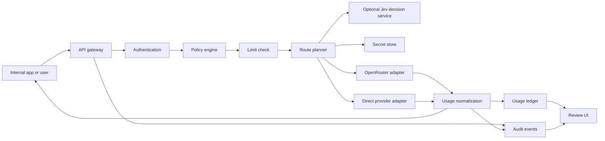

# Architecture Draft

Status: Internal authorization, portable deployment, dual upstream modes, initial selection controls, and same-kind fallback are decided; exact scoring and several release policies remain open. Updated 2026-09-27.

## Core decision

OpenGranter does **not** call AWS IAM to decide access. Its policy engine adopts default denial, explicit Deny precedence, and principal/action/resource concepts. It does not reproduce every AWS IAM policy type, STS, AssumeRole, SigV4, or cross-account semantics. A role is an assignable policy grouping, not a temporary role session in the first release.

## Request path



Authenticate and resolve the model alias to administrator-approved route candidates before authorization. Evaluate the applicable policy and limits for the requested model and the complete enforceable destination scope before contacting an upstream. A route that could select an unevaluated destination is rejected. Track upstream errors, timeouts, and client cancellation by request ID. If an upstream does not report token usage, store it as unknown rather than zero.

## Routing modes

| Mode | Selection owner | Credential and destination | Audit and accounting |
| --- | --- | --- | --- |
| Delegated | OpenRouter selects its eventual inference provider within an approved and enforceable route scope | OpenGranter uses a server-held OpenRouter key; the caller never receives it | Record OpenGranter's decision plus OpenRouter generation ID, actual model/provider when reported, and upstream cost |
| Managed | OpenGranter selects a registered direct provider and model | OpenGranter uses the selected provider's server-held key and registered host | Record the candidate set, selected route, attempted routes, provider response, and cost source |

A managed route may use TypeSafe Jev as a decision service. OpenGranter first applies IAM and all other eligibility checks, then sends only approved candidate descriptions to Jev. Jev returns a candidate ID; OpenGranter checks membership in the eligible set and calls the direct provider itself. Jev never supplies the upstream URL, provider credential, or route kind. Its API credential is a separate server-held secret. If Jev fails or gives an unusable recommendation, the confirmed fallback policy selects the first eligible candidate in administrator order and records the fallback reason. Sending prompt text to Jev requires an explicit administrator setting; the default request contains route metadata only. This disclosure default and the TypeSafe integration target remain pending product-owner confirmation. See [the routing contract](routing.md) and [ADR 0005](adr/0005-jev-as-managed-decision-service.md).

The TypeScript managed invocation coordinator connects IAM candidate filtering, a limit-check port, an audit-write port, and a direct-adapter invocation port. When a trusted route includes Jev settings, it also uses a Jev secret-reference port and the decision client; without those settings it selects the first eligible candidate in administrator order and records `source: "order"` before inference. The trusted caller must already authenticate the principal and provide a versioned route snapshot whose candidates have passed capability and health checks. The coordinator writes the start and decision audit events before the external decision and inference calls respectively. Its ports are tested with fakes; concrete HTTP authentication, durable stores, and usage reconciliation are still required for a runnable gateway.

The authenticated gateway requires a principal ID, credential ID, and policy IDs/versions before route lookup. These nonsecret references travel with the fixed request snapshot into invalid-request, route-failure, authorization, selection, decision, and attempt events. Authentication failures retain only the request ID because the caller's identity is untrusted. Missing attribution fails closed. Deployment wiring of durable audit storage, reader authorization, and retention remain separate work.

A PostgreSQL append adapter now projects the existing gateway, managed-route, and delegated-route audit events into allowlisted metadata fields before inserting them. It stores occurrence time, request ID, kind, authenticated attribution when present, and event-specific JSONB details. Anonymous authentication failures keep identity columns null. Unknown kinds, malformed details, and database errors produce fixed safe errors; required audit calls can therefore fail closed. The adapter does not serialize the original event object or retain prompts, responses, credentials, or upstream error bodies. Connection provisioning, read authorization, retention, tamper-resistant export, and retry/deduplication after ambiguous writes remain open.

A PostgreSQL audit reader selects one principal's events with a bound principal filter and descending event-ID keyset cursor. It validates every row and reuses the append projector to remove unexpected JSONB properties before returning a page. It rejects mixed-principal, anonymous, malformed, oversized, or out-of-order results as a whole. The authenticated `GET /v1/audit` boundary uses this injected reader after evaluating `audit:Read` on the target `principal:<id>`, including when the target defaults to the caller. It reprojects the returned page before responding and audits successful, denied, and unavailable reads. Anonymous/organization-wide search, retention, and export remain separate work.

A text-only, non-streaming `POST /v1/chat/completions` HTTP handler authenticates the presented proxy token through an injected identity port, validates the minimal request shape, resolves a trusted route, and dispatches a managed or delegated coordinator. The identity adapter verifies a credential through a port, loads a trusted principal/role/policy snapshot, and resolves every direct and inherited attachment before passing statements to the gateway. A PostgreSQL-backed credential store supplies an opaque-token verifier to that port. It stores only the SHA-256 digest of a versioned token containing independent random lookup and secret components. Every verification checks expiry and revocation, and issue and revoke writes append nonsecret lifecycle events atomically. The raw token is returned only on successful issuance. A trusted internal management coordinator evaluates `iam:Manage` on the target `principal:<id>` and writes a nonsecret decision audit before using the token primitive. For revocation it looks up the credential's immutable owner; a caller cannot nominate another target to widen authority. Successful mutation and lifecycle audit remain atomic in the token service. The coordinator takes an already authenticated actor with resolved policy statements, so SSO and an HTTP management endpoint remain separate work. Revoked or inactive identities and incomplete attachments fail closed; a missing or inconsistent snapshot returns a safe availability error. A Node HTTP server bridge exposes the handler on a socket; integration tests reach both route kinds with real HTTP requests and fake infrastructure ports. Direct OpenAI, Anthropic, and Gemini adapters translate the text subset against fixed official hosts through injected secret and HTTP ports. Deployable database connections and concrete provider-slug mapping, secret, and limit stores remain missing; several snapshot, route, audit, and usage storage adapters are available but not yet wired into a deployment. This slice does not settle the release-level API field or streaming contract. See [ADR 0006](adr/0006-opaque-proxy-tokens.md).

A PostgreSQL catalog read adapter supplies the published-model and route-resolution ports. Each alias stores publication time, enabled state, and a reference to one active versioned route snapshot for that same alias. The reader returns only that active route, with ordered candidate IDs and secret references; it validates the entire bounded catalog snapshot before returning. Managed route snapshots may contain complete Jev settings or omit them entirely; missing Jev settings select the first IAM-eligible candidate in administrator order. The publication management API remains separate work. The storage choice of one active route for this reader does not settle how the product chooses among multiple routes in a future release.

The same authenticated HTTP boundary serves `GET /v1/models` from an injected administrator-published catalog. It returns an alias once if at least one managed or delegated candidate passes both model and final-provider IAM checks. Disabled, denied, malformed, or duplicate catalog entries never leak into a partial response; malformed or unavailable catalog snapshots fail closed with a safe service error. The response uses the alias's trusted publication timestamp and `owned_by: "opengranter"`. Listing does not call Jev, limits, secrets, or inference providers. A nonsecret listing audit event records the visible count before the response is returned.

A bounded OpenRouter adapter accepts one trusted model slug and an already-authorized set of OpenRouter provider slugs for the same text-only chat subset. It constructs `provider.only`, calls the fixed official endpoint with a server-held key, and normalizes the generation ID and known usage without exposing the key. The delegated coordinator filters model and final-provider IAM permissions, selects one upstream model, obtains exact verified slugs from an injected trusted mapping port, checks limits, writes attributed selection audit including the exact `provider.only` set, invokes the adapter, and writes the outcome before replying. Missing or ambiguous mappings fail closed. The concrete mapping verification workflow remains unresolved; an unverified broader slug would violate the IAM boundary and must not be supplied by a deployment.

After a Jev choice, the coordinator can try each remaining authorized managed candidate once when a direct adapter explicitly classifies a failure before any upstream response starts. It records every attempt before moving on, never crosses into a delegated route, and never re-queries Jev during that request. Current direct adapters treat an HTTP 429 or 5xx response as response-started and stop replay; a pre-response timeout may retry. An unclassified failure or any response-started failure ends the chain. Adapters must report possible billing for uncertain attempts; durable usage reconciliation remains separate work.

Both modes expose the same OpenAI-compatible API subset and use the same principal, proxy token, IAM evaluator, limits, and audit pipeline. An administrator may publish different model aliases for different modes or attach multiple approved routes to one alias. A route change is a configuration change with an audit event and version. Fallback stays within the selected route kind; it never silently switches between OpenRouter-delegated and direct managed paths. The [routing contract](routing.md) defines candidate filtering and selection controls; exact scoring and retry triggers remain open.

OpenRouter may use `models`, presets, automatic routing, and provider preferences to pick a model or provider. OpenGranter evaluates `llm:InvokeModel` on the alias and `llm:UseProvider` on each eligible final inference provider. It sends a server-generated `provider.only` allowlist to OpenRouter and rejects any routing field or configuration that could reach an unevaluated model/provider pair. OpenRouter model fallback is handled as separate bounded attempts, not as an unchecked forwarded array. A response's actual model and provider are recorded, but post-response inspection cannot substitute for pre-call authorization. [OpenRouter provider selection](https://openrouter.ai/docs/guides/routing/provider-selection), [OpenRouter fallback](https://openrouter.ai/docs/guides/routing/model-fallbacks).

## Data boundaries

| Component | Data owned | Boundary |
| --- | --- | --- |
| Identity store | Human users, service accounts, role assignments | Separate external IdP identity from internal principal ID |
| Policy store | Versioned policies, attachments, change history | Retain the policy version used for a decision |
| Model catalog and route store | Alias, approved route candidates, upstream model ID, subscription, active state, route version | Callers cannot specify an upstream URL or an unregistered route |
| Secret store | Raw OpenRouter and direct-provider credentials | Application database holds reference and version only |
| Usage ledger | Per-attempt tokens, status, estimated and upstream-reported cost, route and principal attribution | Keep immutable events separate from reporting aggregates; correlate attempts by request ID and reconcile OpenRouter generation IDs |
| Audit event store | Actor, action, target, outcome, request ID | Do not embed raw keys, prompts, or responses |
| Content-audit store | Optionally retained prompts and responses | Link by event ID; separate encryption, access, and retention |

The usage-record builder prepares one content-free record per upstream attempt. Both route coordinators hand it to an injected ledger port before retrying another candidate or returning a response. A stable request ID, route kind, and attempt ordinal identify the handoff. A PostgreSQL adapter stores an allowlisted JSONB record behind a unique attempt ID; exact retries are no-ops and conflicting retries never overwrite the original. Its parameterized migration and write path are verified against embedded PostgreSQL. A failed handoff stops fallback, emits a nonsecret failure audit event when possible, and returns a safe service error without replaying inference. Missing token counts and the actual OpenRouter provider remain unknown. When one OpenRouter call permits several candidates, its selected candidate also remains unknown. Estimated and upstream-billed costs retain separate provenance, but neither is calculated here. Connection provisioning, deployment migration orchestration, recovery after database outages, and reconciliation remain later work.

A TypeScript migration runner accepts the ordered SQL sources and a dedicated transaction-capable PostgreSQL connection. It tracks each applied version with a SHA-256 checksum, rejects changed or missing historical versions before later SQL, and commits each migration's SQL with its history row in one transaction. Tests apply all current migrations together against embedded PostgreSQL. The runner does not open production connections, coordinate multiple migrator processes, or provide down migrations; deployments must run one migrator per database until those operational controls are designed.

The authenticated `GET /v1/usage` extension reads one principal at a time. An omitted `principal_id` evaluates `usage:ReadSelf` on the caller's `principal:<id>` resource; an explicit `principal_id` evaluates `usage:ReadAll` on that target, even when the target is the caller. The PostgreSQL reader always binds the principal filter and uses occurrence time plus attempt ID for bounded keyset pagination. The HTTP boundary validates and projects stored rows, rejects mixed-principal or malformed results as a whole, and writes a nonsecret read audit event before returning. CSV export, aggregate views, and deployed connection provisioning remain later work.

## Policy contract

Example:

```json
{
  "version": "1",
  "statements": [
    {"effect": "Allow", "actions": ["llm:InvokeModel"], "resources": ["model:approved-*"]},
    {"effect": "Deny", "actions": ["llm:InvokeModel"], "resources": ["model:approved-expensive"]}
  ]
}
```

Evaluation: principal active state → credential scope → direct and role policies → explicit Deny → Allow → default Deny. Only `*` is a wildcard; regular expressions are not supported. Administrators pass through policy evaluation, with an explicit system policy granting bootstrap rights. Supported conditions, such as time or team, require a separate decision. The policy simulator must call the same evaluator as the gateway.

A PostgreSQL identity reader stores principals, roles, versioned policies, and their attachments in normalized tables. It loads one principal's direct policy IDs, assigned roles, and referenced policies in one SQL statement to retain a consistent database view. The reader validates the JSONB policy statements and returns only the fields expected by the existing attachment authenticator. Missing principals return no snapshot; malformed or incomplete references fail closed with a safe availability error. Management writes, SSO identity mapping, policy version history, and connection provisioning remain separate work.

## API and operations

Implementation language: TypeScript on Node.js 22. Code rules and quality gates are in [coding.md](coding.md). PostgreSQL is implemented for the usage-ledger write adapter; API framework, UI library, and persistence choices for the other stores remain open.

- External API: `GET /v1/models`, `POST /v1/chat/completions`, `GET /v1/usage`, and `GET /v1/audit` (the latter two are authenticated extensions).
- Management API: principals, roles, policies, providers/subscriptions, models, credentials, usage, and audit events.
- Upstream adapters: normalize requests, responses, errors, and token data. Build OpenRouter, OpenAI, Anthropic Messages, and Google Gemini adapters for the first release.
- Route planner: resolve aliases, filter to registered and allowed model/provider pairs, select healthy candidates using price by default or an administrator's order/latency/throughput preference, and document every attempted route. Fallback stays within one route kind. Exact scores and retry triggers remain open.
- Deployment: support AWS and on-premises installations through environment-specific implementations of storage and infrastructure interfaces.
- Observability: collect request IDs, latency, status, provider failure rates, and audit-write failures. Keep raw prompts out of operational logs and metrics; only store them in the protected content-audit store when enabled.

## Failure and security boundaries

Fail closed when authentication, policy, route bounds, secrets, or required audit writes fail. If usage recording fails after a completed upstream call, recover the ledger through a retry queue and alert. Enforce request-size and time limits. Restrict upstream destinations to administrator-registered hosts and test defenses against redirects, private IPs, and DNS changes. Streaming requires defined handling for token accounting and interrupted connections before release. A direct OpenRouter key outside OpenGranter can bypass its policies; an organization that requires enforcement must govern direct key access separately.

## Decisions still needed

1. Supported OpenRouter request options and first API capability set across all four adapters.
2. Company SSO protocol, proxy-token maximum lifetime, and trusted management API for service-account credentials.
3. Operational configuration, secret delivery, migration coordination, and process startup for the PostgreSQL driver and secret stores in AWS and on-premises deployments.
4. Whether monthly limits warn or block, and how concurrent calls reserve capacity.
5. Content-audit default, configuration scope, retention, reader permissions, and tamper-resistant export.
6. Whether streaming is part of the initial release.
7. Exact managed-route score, metric freshness, and retry triggers.
8. OpenRouter provider-ID mapping and verification of provider restrictions for delegated routes.

## References

- [AWS IAM policy evaluation](https://docs.aws.amazon.com/IAM/latest/UserGuide/reference_policies_evaluation-logic_policy-eval-denyallow.html)
- [OpenRouter API format](https://openrouter.ai/docs/quickstart)
- [AWS Secrets Manager](https://docs.aws.amazon.com/secretsmanager/latest/userguide/intro.html)

## PostgreSQL gateway composition

`createPostgresChatHandler` connects the existing credential verifier, IAM snapshot reader, model catalog, audit append/history, and usage append/history to the HTTP handler through one injected query client. The caller supplies request IDs, clock, limits, secrets, and registered provider ports. It neither opens connections nor runs migrations, issues tokens, or creates management endpoints. Embedded PostgreSQL integration tests apply all migrations and exercise issued tokens through HTTP authorization, inference, and persisted history. Connection provisioning and process startup remain deployment work.

`createNodeRequestServer` adapts an already-composed Fetch-style handler to a Node socket server. The original gateway-port factory and `createNodePostgresChatServer` share that bridge. The PostgreSQL server factory returns an unbound server; callers own listen/close, database connections, and process lifecycle. Socket integration tests reach the PostgreSQL stores and a registered direct adapter through real HTTP, with a fake provider transport.

## PostgreSQL driver ownership

`createPostgresConnection` creates a node-postgres pool from trusted deployment configuration. Its query port supports existing stores and HTTP composition; its transaction port supports migrations. `adaptPostgresPool` owns an injected pool with the same lifecycle. Transactions acquire one dedicated client, invalidate the callback handle before commit/release, roll back callback failures, reject success after even a caught query failure, and discard connections after uncertain commits or failed rollback. Checked-out client error events prevent commit and discard the connection. Driver errors become fixed `PostgresUnavailable` errors without SQL, parameters, connection credentials, or nested driver causes. Application callback errors survive successful rollback. No transaction or inference is automatically replayed.

An optional idle-error notification receives only that safe error; notification failures cannot crash the pool listener. `close()` is idempotent, rejects new work, and drains existing pool clients. Callers own HTTP shutdown order, configuration/TLS, secret delivery, pool limits, migrations, and concurrent migrator coordination. The factory does not load environment variables or start a process. CI uses a disposable PostgreSQL service to verify the full migration set, parameter binding, rollback, and closure. Local integration runs require `OPENGRANTER_TEST_DATABASE_URL` pointing to a disposable database; never point this test at production.


## Persisted direct provider registrations

Migration `007` adds `direct_provider_registrations` for administrator-managed OpenAI, Anthropic, and Google configuration: provider ID, kind, secret reference, enabled state, and optional output-token limit. Anthropic requires an explicit positive limit; any configured limit must fit a JavaScript safe integer. This table holds references, not provider keys or arbitrary upstream URLs.

`createPostgresDirectProviderRegistrationReader` queries enabled rows in provider-ID order and validates the complete snapshot with the same validator used by the direct invoker. It returns only allowlisted fields, makes defensive copies, and exposes a fixed safe availability error for SQL failures or malformed/duplicate rows. Disabled or unregistered providers cannot trigger secret lookup or transport through an invoker built from this snapshot. All hosts remain fixed by provider kind and IAM still governs model/provider eligibility.

Deployment code explicitly loads registrations and constructs the direct invoker. It must reload and rebuild that invoker after configuration changes; the snapshot does not provide immediate live disablement or rotation. Publication writes, configuration-change audit, IAM-protected management, and reload orchestration remain separate work. No new HTTP endpoint is added.


## Gateway composition with persisted direct registrations

`createPostgresDirectChatHandler` loads one validated registration snapshot and supplies a direct invoker to the existing PostgreSQL HTTP handler. `createNodePostgresDirectChatServer` exposes that handler as an unbound Node server after the load succeeds. Both accept the caller's secret resolver, limits, clock, request IDs, and optional delegated/Jev ports. Direct transport and timeout options are forwarded to the existing adapter. Construction reads configuration only: no provider secret lookup, inference, migration, listening, or database shutdown occurs.

Unavailable or malformed registration storage rejects construction with its fixed safe error; no server is returned. Empty registrations are valid for deployments that have only delegated routes or no published managed models. Registered direct calls still pass through token authentication, full IAM destination evaluation, limits, audit, and usage accounting. The configuration is a startup snapshot, so deployments rebuild the handler/server after changing registrations. Callers continue owning database and HTTP resource lifecycle. Existing custom-invoker factories retain their signatures.
