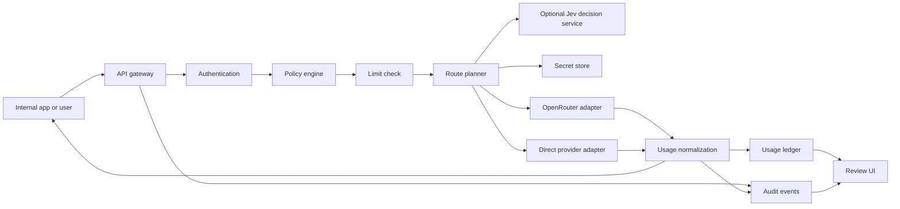

# Architecture Draft

Status: Internal authorization, portable deployment, dual upstream modes, initial selection controls, and same-kind fallback are decided; exact scoring and several release policies remain open. Updated 2026-09-27.

## Core decision

OpenGranter does **not** call AWS IAM to decide access. Its policy engine adopts default denial, explicit Deny precedence, and principal/action/resource concepts. It does not reproduce every AWS IAM policy type, STS, AssumeRole, SigV4, or cross-account semantics. A role is an assignable policy grouping, not a temporary role session in the first release.

## Request path



Authenticate and resolve the model alias to administrator-approved route candidates before authorization. Evaluate the applicable policy and limits for the requested model and the complete enforceable destination scope before contacting an upstream. A route that could select an unevaluated destination is rejected. Track upstream errors, timeouts, and client cancellation by request ID. If an upstream does not report token usage, store it as unknown rather than zero.

## Routing modes

| Mode | Selection owner | Credential and destination | Audit and accounting |
| --- | --- | --- | --- |
| Delegated | OpenRouter selects its eventual inference provider within an approved and enforceable route scope | OpenGranter uses a server-held OpenRouter key; the caller never receives it | Record OpenGranter's decision plus OpenRouter generation ID, actual model/provider when reported, and upstream cost |
| Managed | OpenGranter selects a registered direct provider and model | OpenGranter uses the selected provider's server-held key and registered host | Record the candidate set, selected route, attempted routes, provider response, and cost source |

A managed route may use TypeSafe Jev as a decision service. OpenGranter first applies IAM and all other eligibility checks, then sends only approved candidate descriptions to Jev. Jev returns a candidate ID; OpenGranter checks membership in the eligible set and calls the direct provider itself. Jev never supplies the upstream URL, provider credential, or route kind. Its API credential is a separate server-held secret. If Jev fails or gives an unusable recommendation, the confirmed fallback policy selects the first eligible candidate in administrator order and records the fallback reason. Sending prompt text to Jev requires an explicit administrator setting; the default request contains route metadata only. This disclosure default and the TypeSafe integration target remain pending product-owner confirmation. See [the routing contract](routing.md) and [ADR 0005](adr/0005-jev-as-managed-decision-service.md).

The TypeScript managed invocation coordinator connects IAM candidate filtering, a limit-check port, a Jev secret-reference port, the Jev decision client, an audit-write port, and a direct-adapter invocation port. The trusted caller must already authenticate the principal and provide a versioned route snapshot whose candidates have passed capability and health checks. The coordinator writes the start and decision audit events before the external decision and inference calls respectively. Its ports are tested with fakes; concrete HTTP authentication, durable stores, and usage reconciliation are still required for a runnable gateway.

The authenticated gateway requires a principal ID, credential ID, and policy IDs/versions before route lookup. These nonsecret references travel with the fixed request snapshot into invalid-request, route-failure, authorization, selection, decision, and attempt events. Authentication failures retain only the request ID because the caller's identity is untrusted. Missing attribution fails closed. Durable audit storage, reader authorization, and retention remain separate work.

A text-only, non-streaming `POST /v1/chat/completions` HTTP handler authenticates the presented proxy token through an injected identity port, validates the minimal request shape, resolves a trusted managed route, and calls the coordinator. The identity adapter verifies a credential through a port, loads a trusted principal/role/policy snapshot, and resolves every direct and inherited attachment before passing statements to the gateway. Revoked or inactive identities and incomplete attachments fail closed; a missing or inconsistent snapshot returns a safe availability error. A Node HTTP server bridge exposes the handler on a socket; the integration test reaches it with a real HTTP request and fake infrastructure ports. Direct OpenAI, Anthropic, and Gemini adapters translate that subset against fixed official hosts through injected secret and HTTP ports. No deployable configuration or concrete credential, snapshot, route, secret, audit, or limit store exists yet. This slice does not settle the release-level API field or streaming contract.

The same authenticated HTTP boundary serves `GET /v1/models` from an injected administrator-published catalog. It returns an alias once if at least one managed or delegated candidate passes both model and final-provider IAM checks. Disabled, denied, malformed, or duplicate catalog entries never leak into a partial response; malformed or unavailable catalog snapshots fail closed with a safe service error. The response uses the alias's trusted publication timestamp and `owned_by: "opengranter"`. Listing does not call Jev, limits, secrets, or inference providers. A nonsecret listing audit event records the visible count before the response is returned.

A bounded OpenRouter adapter now accepts one trusted model slug and an already-authorized set of OpenRouter provider slugs for the same text-only chat subset. It constructs `provider.only`, calls the fixed official endpoint with a server-held key, and normalizes the generation ID and known usage without exposing the key. The gateway does not yet dispatch delegated routes to this adapter. IAM filtering, internal-provider-to-OpenRouter-slug mapping, limits, and required audit writes must be integrated before that dispatch is enabled; the adapter's input alone is not an authorization decision.

After a Jev choice, the coordinator can try each remaining authorized managed candidate once when a direct adapter explicitly classifies a failure before any upstream response starts. It records every attempt before moving on, never crosses into a delegated route, and never re-queries Jev during that request. Current direct adapters treat an HTTP 429 or 5xx response as response-started and stop replay; a pre-response timeout may retry. An unclassified failure or any response-started failure ends the chain. Adapters must report possible billing for uncertain attempts; durable usage reconciliation remains separate work.

Both modes expose the same OpenAI-compatible API subset and use the same principal, proxy token, IAM evaluator, limits, and audit pipeline. An administrator may publish different model aliases for different modes or attach multiple approved routes to one alias. A route change is a configuration change with an audit event and version. Fallback stays within the selected route kind; it never silently switches between OpenRouter-delegated and direct managed paths. The [routing contract](routing.md) defines candidate filtering and selection controls; exact scoring and retry triggers remain open.

OpenRouter may use `models`, presets, automatic routing, and provider preferences to pick a model or provider. OpenGranter evaluates `llm:InvokeModel` on the alias and `llm:UseProvider` on each eligible final inference provider. It sends a server-generated `provider.only` allowlist to OpenRouter and rejects any routing field or configuration that could reach an unevaluated model/provider pair. OpenRouter model fallback is handled as separate bounded attempts, not as an unchecked forwarded array. A response's actual model and provider are recorded, but post-response inspection cannot substitute for pre-call authorization. [OpenRouter provider selection](https://openrouter.ai/docs/guides/routing/provider-selection), [OpenRouter fallback](https://openrouter.ai/docs/guides/routing/model-fallbacks).

## Data boundaries

| Component | Data owned | Boundary |
| --- | --- | --- |
| Identity store | Human users, service accounts, role assignments | Separate external IdP identity from internal principal ID |
| Policy store | Versioned policies, attachments, change history | Retain the policy version used for a decision |
| Model catalog and route store | Alias, approved route candidates, upstream model ID, subscription, active state, route version | Callers cannot specify an upstream URL or an unregistered route |
| Secret store | Raw OpenRouter and direct-provider credentials | Application database holds reference and version only |
| Usage ledger | Per-request tokens, status, estimated and upstream-reported cost, route and principal attribution | Keep immutable events separate from reporting aggregates; reconcile OpenRouter generation IDs |
| Audit event store | Actor, action, target, outcome, request ID | Do not embed raw keys, prompts, or responses |
| Content-audit store | Optionally retained prompts and responses | Link by event ID; separate encryption, access, and retention |

## Policy contract

Example:

```json
{
  "version": "1",
  "statements": [
    {"effect": "Allow", "actions": ["llm:InvokeModel"], "resources": ["model:approved-*"]},
    {"effect": "Deny", "actions": ["llm:InvokeModel"], "resources": ["model:approved-expensive"]}
  ]
}
```

Evaluation: principal active state → credential scope → direct and role policies → explicit Deny → Allow → default Deny. Only `*` is a wildcard; regular expressions are not supported. Administrators pass through policy evaluation, with an explicit system policy granting bootstrap rights. Supported conditions, such as time or team, require a separate decision. The policy simulator must call the same evaluator as the gateway.

## API and operations

Implementation language: TypeScript on Node.js 22. Code rules and quality gates are in [coding.md](coding.md). The pure policy evaluator and principal/role attachment resolver are the first implemented slices; API framework, UI library, and persistence choices remain open.

- External API: `GET /v1/models`, `POST /v1/chat/completions`.
- Management API: principals, roles, policies, providers/subscriptions, models, credentials, usage, and audit events.
- Upstream adapters: normalize requests, responses, errors, and token data. Build OpenRouter, OpenAI, Anthropic Messages, and Google Gemini adapters for the first release.
- Route planner: resolve aliases, filter to registered and allowed model/provider pairs, select healthy candidates using price by default or an administrator's order/latency/throughput preference, and document every attempted route. Fallback stays within one route kind. Exact scores and retry triggers remain open.
- Deployment: support AWS and on-premises installations through environment-specific implementations of storage and infrastructure interfaces.
- Observability: collect request IDs, latency, status, provider failure rates, and audit-write failures. Keep raw prompts out of operational logs and metrics; only store them in the protected content-audit store when enabled.

## Failure and security boundaries

Fail closed when authentication, policy, route bounds, secrets, or required audit writes fail. If usage recording fails after a completed upstream call, recover the ledger through a retry queue and alert. Enforce request-size and time limits. Restrict upstream destinations to administrator-registered hosts and test defenses against redirects, private IPs, and DNS changes. Streaming requires defined handling for token accounting and interrupted connections before release. A direct OpenRouter key outside OpenGranter can bypass its policies; an organization that requires enforcement must govern direct key access separately.

## Decisions still needed

1. Supported OpenRouter request options and first API capability set across all four adapters.
2. Company SSO protocol and service-account credential format.
3. Database and secret-store implementations for AWS and on-premises deployments.
4. Whether monthly limits warn or block, and how concurrent calls reserve capacity.
5. Content-audit default, configuration scope, retention, reader permissions, and tamper-resistant export.
6. Whether streaming is part of the initial release.
7. Exact managed-route score, metric freshness, and retry triggers.
8. OpenRouter provider-ID mapping and verification of provider restrictions for delegated routes.

## References

- [AWS IAM policy evaluation](https://docs.aws.amazon.com/IAM/latest/UserGuide/reference_policies_evaluation-logic_policy-eval-denyallow.html)
- [OpenRouter API format](https://openrouter.ai/docs/quickstart)
- [AWS Secrets Manager](https://docs.aws.amazon.com/secretsmanager/latest/userguide/intro.html)
