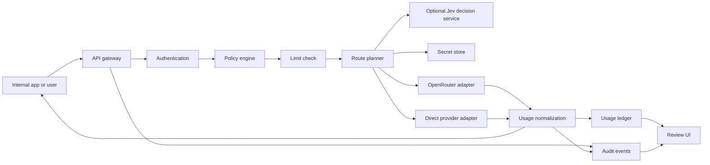

# Architecture Draft

Status: Internal authorization, portable deployment, dual upstream modes, initial selection controls, and same-kind fallback are decided; exact scoring and several release policies remain open. Updated 2026-09-27.

## Core decision

OpenGranter does **not** call AWS IAM to decide access. Its policy engine adopts default denial, explicit Deny precedence, and principal/action/resource concepts. It does not reproduce every AWS IAM policy type, STS, AssumeRole, SigV4, or cross-account semantics. A role is an assignable policy grouping, not a temporary role session in the first release.

## Request path



Authenticate and resolve the model alias to administrator-approved route candidates before authorization. Evaluate the applicable policy and limits for the requested model and the complete enforceable destination scope before contacting an upstream. A route that could select an unevaluated destination is rejected. Track upstream errors, timeouts, and client cancellation by request ID. If an upstream does not report token usage, store it as unknown rather than zero.

## Routing modes

| Mode | Selection owner | Credential and destination | Audit and accounting |
| --- | --- | --- | --- |
| Delegated | OpenRouter selects its eventual inference provider within an approved and enforceable route scope | OpenGranter uses a server-held OpenRouter key; the caller never receives it | Record OpenGranter's decision plus OpenRouter generation ID, actual model/provider when reported, and upstream cost |
| Managed | OpenGranter selects a registered direct provider and model | OpenGranter uses the selected provider's server-held key and registered host | Record the candidate set, selected route, attempted routes, provider response, and cost source |

A managed route may use TypeSafe Jev as a decision service. OpenGranter first applies IAM and all other eligibility checks, then sends only approved candidate descriptions to Jev. Jev returns a candidate ID; OpenGranter checks membership in the eligible set and calls the direct provider itself. Jev never supplies the upstream URL, provider credential, or route kind. Its API credential is a separate server-held secret. If Jev fails or gives an unusable recommendation, the confirmed fallback policy selects the first eligible candidate in administrator order and records the fallback reason. Sending prompt text to Jev requires an explicit administrator setting; the default request contains route metadata only. This disclosure default and the TypeSafe integration target remain pending product-owner confirmation. See [the routing contract](routing.md) and [ADR 0005](adr/0005-jev-as-managed-decision-service.md).

The TypeScript managed invocation coordinator connects IAM candidate filtering, a limit-check port, an audit-write port, and a direct-adapter invocation port. When a trusted route includes Jev settings, it also uses a Jev secret-reference port and the decision client; without those settings it selects the first eligible candidate in administrator order and records `source: "order"` before inference. The trusted caller must already authenticate the principal and provide a versioned route snapshot whose candidates have passed capability and health checks. The coordinator writes the start and decision audit events before the external decision and inference calls respectively. Its ports are tested with fakes; concrete HTTP authentication, durable stores, and usage reconciliation are still required for a runnable gateway.

The authenticated gateway requires a principal ID, credential ID, and policy IDs/versions before route lookup. These nonsecret references travel with the fixed request snapshot into invalid-request, route-failure, authorization, selection, decision, and attempt events. Authentication failures retain only the request ID because the caller's identity is untrusted. Missing attribution fails closed. Deployment wiring of durable audit storage, reader authorization, and retention remain separate work.

A PostgreSQL append adapter now projects the existing gateway, managed-route, and delegated-route audit events into allowlisted metadata fields before inserting them. It stores occurrence time, request ID, kind, authenticated attribution when present, and event-specific JSONB details. Anonymous authentication failures keep identity columns null. Unknown kinds, malformed details, and database errors produce fixed safe errors; required audit calls can therefore fail closed. The adapter does not serialize the original event object or retain prompts, responses, credentials, or upstream error bodies. Connection provisioning, read authorization, retention, tamper-resistant export, and retry/deduplication after ambiguous writes remain open.

A PostgreSQL audit reader selects one principal's events with a bound principal filter and descending event-ID keyset cursor. It validates every row and reuses the append projector to remove unexpected JSONB properties before returning a page. It rejects mixed-principal, anonymous, malformed, oversized, or out-of-order results as a whole. The authenticated `GET /v1/audit` boundary uses this injected reader after evaluating `audit:Read` on the target `principal:<id>`, including when the target defaults to the caller. It reprojects the returned page before responding and audits successful, denied, and unavailable reads. Anonymous/organization-wide search, retention, and export remain separate work.

A text-only, non-streaming `POST /v1/chat/completions` HTTP handler authenticates the presented proxy token through an injected identity port, validates the minimal request shape, resolves a trusted route, and dispatches a managed or delegated coordinator. The identity adapter verifies a credential through a port, loads a trusted principal/role/policy snapshot, and resolves every direct and inherited attachment before passing statements to the gateway. A PostgreSQL-backed credential store supplies an opaque-token verifier to that port. It stores only the SHA-256 digest of a versioned token containing independent random lookup and secret components. Every verification checks expiry and revocation, and issue and revoke writes append nonsecret lifecycle events atomically. The raw token is returned only on successful issuance. A trusted internal management coordinator evaluates `iam:Manage` on the target `principal:<id>` and writes a nonsecret decision audit before using the token primitive. For revocation it looks up the credential's immutable owner; a caller cannot nominate another target to widen authority. Successful mutation and lifecycle audit remain atomic in the token service. The coordinator takes an already authenticated actor with resolved policy statements, so SSO and an HTTP management endpoint remain separate work. Revoked or inactive identities and incomplete attachments fail closed; a missing or inconsistent snapshot returns a safe availability error. A Node HTTP server bridge exposes the handler on a socket; integration tests reach both route kinds with real HTTP requests and fake infrastructure ports. Direct OpenAI, Anthropic, and Gemini adapters translate the text subset against fixed official hosts through injected secret and HTTP ports. Provider-slug mapping reads now have a PostgreSQL adapter; secret and limit implementations remain deployment work; several snapshot, route, audit, and usage storage adapters are available but not yet wired into a deployment. This slice does not settle the release-level API field or streaming contract. See [ADR 0006](adr/0006-opaque-proxy-tokens.md).

A PostgreSQL catalog read adapter supplies the published-model and route-resolution ports. Each alias stores publication time, enabled state, and a reference to one active versioned route snapshot for that same alias. The reader returns only that active route, with ordered candidate IDs and secret references; it validates the entire bounded catalog snapshot before returning. Managed route snapshots may contain complete Jev settings or omit them entirely; missing Jev settings select the first IAM-eligible candidate in administrator order. The publication management API remains separate work. The storage choice of one active route for this reader does not settle how the product chooses among multiple routes in a future release.

The same authenticated HTTP boundary serves `GET /v1/models` from an injected administrator-published catalog. It returns an alias once if at least one managed or delegated candidate passes both model and final-provider IAM checks. Disabled, denied, malformed, or duplicate catalog entries never leak into a partial response; malformed or unavailable catalog snapshots fail closed with a safe service error. The response uses the alias's trusted publication timestamp and `owned_by: "opengranter"`. Listing does not call Jev, limits, secrets, or inference providers. A nonsecret listing audit event records the visible count before the response is returned.

A bounded OpenRouter adapter accepts one trusted model slug and an already-authorized set of OpenRouter provider slugs for the same text-only chat subset. It constructs `provider.only`, calls the fixed official endpoint with a server-held key, and normalizes the generation ID and known usage without exposing the key. The delegated coordinator filters model and final-provider IAM permissions, selects one upstream model, obtains exact verified slugs from an injected trusted mapping port, checks limits, writes attributed selection audit including the exact `provider.only` set, invokes the adapter, and writes the outcome before replying. Missing or ambiguous mappings fail closed. The concrete mapping verification workflow remains unresolved; an unverified broader slug would violate the IAM boundary and must not be supplied by a deployment.

After a Jev choice, the coordinator can try each remaining authorized managed candidate once when a direct adapter explicitly classifies a failure before any upstream response starts. It records every attempt before moving on, never crosses into a delegated route, and never re-queries Jev during that request. Current direct adapters treat an HTTP 429 or 5xx response as response-started and stop replay; a pre-response timeout may retry. An unclassified failure or any response-started failure ends the chain. Adapters must report possible billing for uncertain attempts; durable usage reconciliation remains separate work.

Both modes expose the same OpenAI-compatible API subset and use the same principal, proxy token, IAM evaluator, limits, and audit pipeline. An administrator may publish different model aliases for different modes or attach multiple approved routes to one alias. A route change is a configuration change with an audit event and version. Fallback stays within the selected route kind; it never silently switches between OpenRouter-delegated and direct managed paths. The [routing contract](routing.md) defines candidate filtering and selection controls; exact scoring and retry triggers remain open.

OpenRouter may use `models`, presets, automatic routing, and provider preferences to pick a model or provider. OpenGranter evaluates `llm:InvokeModel` on the alias and `llm:UseProvider` on each eligible final inference provider. It sends a server-generated `provider.only` allowlist to OpenRouter and rejects any routing field or configuration that could reach an unevaluated model/provider pair. OpenRouter model fallback is handled as separate bounded attempts, not as an unchecked forwarded array. A response's actual model and provider are recorded, but post-response inspection cannot substitute for pre-call authorization. [OpenRouter provider selection](https://openrouter.ai/docs/guides/routing/provider-selection), [OpenRouter fallback](https://openrouter.ai/docs/guides/routing/model-fallbacks).

## Data boundaries

| Component | Data owned | Boundary |
| --- | --- | --- |
| Identity store | Human users, service accounts, role assignments | Separate external IdP identity from internal principal ID |
| Policy store | Versioned policies, attachments, change history | Retain the policy version used for a decision |
| Model catalog and route store | Alias, approved route candidates, upstream model ID, subscription, active state, route version | Callers cannot specify an upstream URL or an unregistered route |
| Secret store | Raw OpenRouter and direct-provider credentials | Application database holds reference and version only |
| Usage ledger | Per-attempt tokens, status, estimated and upstream-reported cost, route and principal attribution | Keep immutable events separate from reporting aggregates; correlate attempts by request ID and reconcile OpenRouter generation IDs |
| Audit event store | Actor, action, target, outcome, request ID | Do not embed raw keys, prompts, or responses |
| Content-audit store | Optionally retained prompts and responses | Link by event ID; separate encryption, access, and retention |

The usage-record builder prepares one content-free record per upstream attempt. Both route coordinators hand it to an injected ledger port before retrying another candidate or returning a response. A stable request ID, route kind, and attempt ordinal identify the handoff. A PostgreSQL adapter stores an allowlisted JSONB record behind a unique attempt ID; exact retries are no-ops and conflicting retries never overwrite the original. Its parameterized migration and write path are verified against embedded PostgreSQL. A failed handoff stops fallback, emits a nonsecret failure audit event when possible, and returns a safe service error without replaying inference. Missing token counts and the actual OpenRouter provider remain unknown. When one OpenRouter call permits several candidates, its selected candidate also remains unknown. Estimated and upstream-billed costs retain separate provenance, but neither is calculated here. Connection provisioning, deployment migration orchestration, recovery after database outages, and reconciliation remain later work.

A TypeScript migration runner accepts the ordered SQL sources and a dedicated transaction-capable PostgreSQL connection. It tracks each applied version with a SHA-256 checksum, rejects changed or missing historical versions before later SQL, and commits each migration's SQL with its history row in one transaction. Tests apply all current migrations together against embedded PostgreSQL. The runner does not open production connections, coordinate multiple migrator processes, or provide down migrations; deployments must run one migrator per database until those operational controls are designed.

The authenticated `GET /v1/usage` extension reads one principal at a time. An omitted `principal_id` evaluates `usage:ReadSelf` on the caller's `principal:<id>` resource; an explicit `principal_id` evaluates `usage:ReadAll` on that target, even when the target is the caller. The PostgreSQL reader always binds the principal filter and uses occurrence time plus attempt ID for bounded keyset pagination. The HTTP boundary validates and projects stored rows, rejects mixed-principal or malformed results as a whole, and writes a nonsecret read audit event before returning. CSV export, aggregate views, and deployed connection provisioning remain later work.

## Policy contract

Example:

```json
{
  "version": "1",
  "statements": [
    {"effect": "Allow", "actions": ["llm:InvokeModel"], "resources": ["model:approved-*"]},
    {"effect": "Deny", "actions": ["llm:InvokeModel"], "resources": ["model:approved-expensive"]}
  ]
}
```

Evaluation: principal active state → credential scope → direct and role policies → explicit Deny → Allow → default Deny. Only `*` is a wildcard; regular expressions are not supported. Administrators pass through policy evaluation, with an explicit system policy granting bootstrap rights. Supported conditions, such as time or team, require a separate decision. The policy simulator must call the same evaluator as the gateway.

A PostgreSQL identity reader stores principals, roles, versioned policies, and their attachments in normalized tables. It loads one principal's direct policy IDs, assigned roles, and referenced policies in one SQL statement to retain a consistent database view. The reader validates the JSONB policy statements and returns only the fields expected by the existing attachment authenticator. Missing principals return no snapshot; malformed or incomplete references fail closed with a safe availability error. Management writes, SSO identity mapping, policy version history, and connection provisioning remain separate work.

## API and operations

Implementation language: TypeScript on Node.js 22. Code rules and quality gates are in [coding.md](coding.md). PostgreSQL is implemented for the usage-ledger write adapter; API framework, UI library, and persistence choices for the other stores remain open.

- External API: `GET /v1/models`, `POST /v1/chat/completions`, `GET /v1/usage`, and `GET /v1/audit` (the latter two are authenticated extensions).
- Management API: principals, roles, policies, providers/subscriptions, models, credentials, usage, and audit events.
- Upstream adapters: normalize requests, responses, errors, and token data. Build OpenRouter, OpenAI, Anthropic Messages, and Google Gemini adapters for the first release.
- Route planner: resolve aliases, filter to registered and allowed model/provider pairs, select healthy candidates using price by default or an administrator's order/latency/throughput preference, and document every attempted route. Fallback stays within one route kind. Exact scores and retry triggers remain open.
- Deployment: support AWS and on-premises installations through environment-specific implementations of storage and infrastructure interfaces.
- Observability: collect request IDs, latency, status, provider failure rates, and audit-write failures. Keep raw prompts out of operational logs and metrics; only store them in the protected content-audit store when enabled.

## Failure and security boundaries

Fail closed when authentication, policy, route bounds, secrets, or required audit writes fail. If usage recording fails after a completed upstream call, recover the ledger through a retry queue and alert. Enforce request-size and time limits. Restrict upstream destinations to administrator-registered hosts and test defenses against redirects, private IPs, and DNS changes. The internal delegated text-stream composition reuses IAM, limits, usage and audit controls before returning terminal frames; Delegated HTTP interruption, cancellation and post-accounting delivery failures follow the [delivery contract](../contracts/delegated-http-stream.md); physical socket acknowledgment and durable failed-audit recovery remain open. A direct OpenRouter key outside OpenGranter can bypass its policies; an organization that requires enforcement must govern direct key access separately.

## Decisions still needed

1. Supported OpenRouter request options and first API capability set across all four adapters.
2. OIDC identity binding and management authentication profile. Human-only first management authentication is confirmed but pending implementation; internal owner-specific lifetime caps are implemented separately.
3. Operational configuration, secret delivery, migration coordination, and process startup for the PostgreSQL driver and secret stores in AWS and on-premises deployments.
4. Whether monthly limits warn or block, and how concurrent calls reserve capacity.
5. Content-audit default, configuration scope, retention, reader permissions, and tamper-resistant export.
6. Streaming interruption, cancellation and usage accounting contracts for required external-client compatibility.
7. Exact managed-route score, metric freshness, and retry triggers.
8. OpenRouter provider-ID mapping and verification of provider restrictions for delegated routes.

## References

- [AWS IAM policy evaluation](https://docs.aws.amazon.com/IAM/latest/UserGuide/reference_policies_evaluation-logic_policy-eval-denyallow.html)
- [OpenRouter API format](https://openrouter.ai/docs/quickstart)
- [AWS Secrets Manager](https://docs.aws.amazon.com/secretsmanager/latest/userguide/intro.html)

## PostgreSQL gateway composition

`createPostgresChatHandler` connects the existing credential verifier, IAM snapshot reader, model catalog, audit append/history, and usage append/history to the HTTP handler through one injected query client. The caller supplies request IDs, clock, limits, secrets, and registered provider ports. It neither opens connections nor runs migrations, issues tokens, or creates management endpoints. Embedded PostgreSQL integration tests apply all migrations and exercise issued tokens through HTTP authorization, inference, and persisted history. Connection provisioning and process startup remain deployment work.

`createNodeRequestServer` adapts an already-composed Fetch-style handler to a Node socket server. The original gateway-port factory and `createNodePostgresChatServer` share that bridge. The PostgreSQL server factory returns an unbound server; callers own listen/close, database connections, and process lifecycle. Socket integration tests reach the PostgreSQL stores and a registered direct adapter through real HTTP, with a fake provider transport.

## PostgreSQL driver ownership

`createPostgresConnection` creates a node-postgres pool from trusted deployment configuration. Its query port supports existing stores and HTTP composition; its transaction port supports migrations. `adaptPostgresPool` owns an injected pool with the same lifecycle. Transactions acquire one dedicated client, invalidate the callback handle before commit/release, roll back callback failures, reject success after even a caught query failure, and discard connections after uncertain commits or failed rollback. Checked-out client error events prevent commit and discard the connection. Driver errors become fixed `PostgresUnavailable` errors without SQL, parameters, connection credentials, or nested driver causes. Application callback errors survive successful rollback. No transaction or inference is automatically replayed.

An optional idle-error notification receives only that safe error; notification failures cannot crash the pool listener. `close()` is idempotent, rejects new work, and drains existing pool clients. Callers own HTTP shutdown order, configuration/TLS, secret delivery, pool limits, migrations, and concurrent migrator coordination. The factory does not load environment variables or start a process. CI uses a disposable PostgreSQL service to verify the full migration set, parameter binding, rollback, and closure. Local integration runs require `OPENGRANTER_TEST_DATABASE_URL` pointing to a disposable database; never point this test at production.


## Persisted direct provider registrations

Migration `007` adds `direct_provider_registrations` for administrator-managed OpenAI, Anthropic, and Google configuration: provider ID, kind, secret reference, enabled state, and optional output-token limit. Anthropic requires an explicit positive limit; any configured limit must fit a JavaScript safe integer. This table holds references, not provider keys or arbitrary upstream URLs.

`createPostgresDirectProviderRegistrationReader` queries enabled rows in provider-ID order and validates the complete snapshot with the same validator used by the direct invoker. It returns only allowlisted fields, makes defensive copies, and exposes a fixed safe availability error for SQL failures or malformed/duplicate rows. Disabled or unregistered providers cannot trigger secret lookup or transport through an invoker built from this snapshot. All hosts remain fixed by provider kind and IAM still governs model/provider eligibility.

Deployment code explicitly loads registrations and constructs the direct invoker. It must reload and rebuild that invoker after configuration changes; the snapshot does not provide immediate live disablement or rotation. Publication writes, configuration-change audit, IAM-protected management, and reload orchestration remain separate work. No new HTTP endpoint is added.

## Usage history filters

`GET /v1/usage` accepts optional `model`, `from_ms`, and `to_ms` in addition to principal selection, limit, and cursor. `model` is an exact requested alias, not an upstream model ID; aliases must be nonblank, at most 256 characters, without control characters. Times are canonical nonnegative safe-integer decimal milliseconds since the Unix epoch. The start is inclusive and the end is exclusive; a supplied start must precede a supplied end. Unknown or repeated parameters remain invalid.

The existing self/specified-principal IAM requirements apply to all filtered reads. PostgreSQL binds filter values alongside the principal predicate and descending keyset cursor, then validates all returned records against those filters. The HTTP boundary repeats this check for any injected ledger. Invalid queries return 400; out-of-filter pages fail with safe 503 and the required unavailable-read audit. No partial response is returned. Clients repeat the filters on subsequent pages; a cursor only sets a position and does not grant a different principal scope. The existing principal/time index supports narrowing; modelAlias uses JSONB extraction and has no dedicated index yet. CSV export and aggregation remain separate work.

## Gateway composition with persisted direct registrations

`createPostgresDirectChatHandler` loads one validated registration snapshot and supplies a direct invoker to the existing PostgreSQL HTTP handler. `createNodePostgresDirectChatServer` exposes that handler as an unbound Node server after the load succeeds. Both accept the caller's secret resolver, limits, clock, request IDs, and optional delegated/Jev ports. Direct transport and timeout options are forwarded to the existing adapter. Construction reads configuration only: no provider secret lookup, inference, migration, listening, or database shutdown occurs.

Unavailable or malformed registration storage rejects construction with its fixed safe error; no server is returned. Empty registrations are valid for deployments that have only delegated routes or no published managed models. Registered direct calls still pass through token authentication, full IAM destination evaluation, limits, audit, and usage accounting. The configuration is a startup snapshot, so deployments rebuild the handler/server after changing registrations. Callers continue owning database and HTTP resource lifecycle. Existing custom-invoker factories retain their signatures.

## Audit occurrence-time filters

`GET /v1/audit` accepts optional inclusive `from_ms` and exclusive `to_ms` occurrence-time bounds in epoch milliseconds. Values must be canonical nonnegative safe-integer decimals; when both are present, start must precede end. Duplicate and unknown query fields remain invalid. The target principal's `audit:Read` requirement applies to every range, including self reads.

The PostgreSQL reader binds the time predicates alongside the principal and event-ID cursor, and validates every row, including its lookahead record. The HTTP projection independently checks occurrence times for injected readers. Out-of-range data rejects the whole page with safe availability errors and required read auditing. Pagination remains descending by event ID, even when recorded occurrence times are not monotonic. Clients repeat the range with the next cursor; the cursor is only a position and never expands principal scope. No dedicated time index or schema change is introduced; benchmark ranges before changing indexes. Retention, organization-wide search, and content auditing remain separate work.

## Usage CSV page export

`GET /v1/usage?format=csv` exports the same authorized, validated usage page as JSON. `format=json` is explicit JSON; JSON remains the default. Unknown or repeated formats return 400. Existing principal selection, model/time filters, limit (at most 100), and cursor continue applying before serialization. No new permission or unbounded scan is introduced.

The response has `text/csv; charset=utf-8`, a fixed attachment filename, `Cache-Control: no-store`, `X-Request-Id`, and `X-Has-More`. `X-Next-Cursor` appears only when additional records exist. Clients repeat filters with that cursor. A file is one page, not a claim that the entire history was exported. Empty pages still contain the header row. Failures remain safe JSON errors, and required attributed usage-read auditing must succeed before any CSV is returned.

Columns are request/attempt/principal/credential identifiers, policy versions, requested alias, route kind, upstream model, candidate/provider attribution, occurrence time, latency, outcome, possibly-billed/duplicate flags, usage availability and counts, estimated decimal amount/currency/price version, and billed decimal amount/currency/source. Unknown values are empty cells; decimal amounts remain strings. The serializer reprojects only the metadata contract, excluding prompts, responses, raw tokens, keys, and extra fields.

Every cell is quoted, embedded quotes are doubled, and rows use CRLF. Formula-looking text (including whitespace, control-prefix, and full-width variants) receives a leading apostrophe for initial spreadsheet import. This intentionally changes CSV cell text; use JSON for exact machine-readable values. Spreadsheet save/reopen behavior varies, so this is not a universal formula-safety guarantee. See [OWASP guidance](https://owasp.org/www-community/attacks/CSV_Injection). Complete-history export jobs, audit CSV, and aggregates remain separate work.


## Audit CSV page export

`GET /v1/audit?format=csv` exports the same fully projected page as JSON; omitted format and explicit `format=json` retain JSON. Invalid/repeated formats return 400 before storage. The target-principal `audit:Read` check, occurrence-time bounds, event-ID cursor, maximum 100 events, and required read audit apply to both formats. Out-of-range, mixed-principal, anonymous, malformed, or unordered pages fail as safe JSON errors before any CSV response.

The response uses `text/csv; charset=utf-8`, the fixed `opengranter-audit.csv` filename, no-store caching, request ID, `X-Has-More`, and optional `X-Next-Cursor`. Clients repeat the principal/time filters with that event-ID cursor. Empty exports contain headers only; each file is one bounded page.

Columns contain event ID, occurrence time, kind, request/principal/credential IDs, policy versions, and sanitized details. Policy versions and details are quoted JSON cells, not arbitrary event bodies. The serializer reuses page projection with explicit target/query context before encoding. Usage and audit share CSV quoting, CRLF, and the documented apostrophe transformation for formula-looking text; usage's output contract stays unchanged. No content, provider keys, raw proxy tokens, or unexpected fields are exported. JSON is the exact machine-readable form. This download is not a tamper-resistant archive; full-history jobs, external retention, and verification remain separate work.

## Persisted token-management decisions

Migration `008` adds `token_management_decisions`. `createPostgresTokenManagementAuditStore` validates and projects only operation, outcome, actor, target owner, request, optional credential, policy IDs/versions, and occurrence time into parameterized SQL. It never serializes the input object or policy statements wholesale. Unknown-owner and inactive-actor revocation denials may have a null target. Revocation decisions have a credential ID; issuance decisions do not yet have one. There is no credential foreign key because nonexistent-credential denials must remain recordable.

`createPostgresTokenManagementCoordinator({ client, now })` connects that required append port to the existing IAM coordinator and PostgreSQL credential service. Trusted callers authenticate actors and resolve their policies before invoking it. Required decision-write failure stops mutation. Credential mutation and lifecycle-event writes remain atomic; decision and mutation are separate writes. A grant can survive a failed mutation and means authorization only. Request and actor IDs correlate decisions with completed lifecycle events; request IDs are correlation values, not deduplication keys. Decisions are outside the gateway audit-history reader. Public management endpoints, history access policy, retention, reconciliation, and tamper resistance remain open.

## Migration-gated server construction

`createMigratedNodePostgresDirectChatServer` accepts the persisted-direct server ports, a query/transaction client, and the complete trusted SQL migration source set. It awaits the existing migration runner before reading registrations or composing the server. Unchanged historical checksums are verified on every construction; migration validation, checksum mismatch, and SQL failures prevent server construction. Fixed safe migration and registration-store errors remain observable without SQL, secrets, or driver causes. Startup does not resolve secrets or contact providers.

The returned Node server is unbound. Callers own listen/close, database shutdown, migration source provisioning/completeness, and exclusive migration coordination. Use repository migration files in version order; never obtain SQL sources from an HTTP caller. Sequential reconstruction skips unchanged migrations and reloads registration snapshots. Each migration commits independently; a later migration or registration-read failure leaves earlier commits intact. Existing lower-level factories remain available when deployment has a separate migration phase. This function does not start a process, provision secrets/limits, automatically roll back schema, or coordinate concurrent migrators.

## Bundled migration source provisioning

`loadPostgresMigrationSources(directory?)` loads the explicit manifest in `src/storage/postgres-migration-sources.ts`. The default directory is resolved relative to the module, not the process working directory. A trusted deployment may supply a local directory URL containing the same complete set. Every SQL entry must be a regular file with a listed name: missing trailing files, unregistered/duplicate-version names, and SQL symlink/directory entries fail before database access. Non-SQL notes are ignored. SQL is read as UTF-8 without rewriting whitespace, comments, or line endings, preserving its checksum text; whitespace-only SQL is rejected. Filesystem and validation failures expose only `MigrationSourceUnavailable`, without paths, SQL, or nested causes.

`createBundledNodePostgresDirectChatServer` accepts migration-capable server ports without a source array and an optional trusted `migrationDirectory`. It fully loads sources before invoking the migration-gated factory. A loading failure performs no database, clock, secret, or provider activity. The returned server remains unbound and retains existing HTTP authentication and IAM behavior.

Ship `migrations/` alongside the source modules and update the explicit manifest whenever adding a migration; the bundled-loader regression checks all shipped SQL files. The manifest detects completeness, not file authenticity. Deployment must protect its bundle from modification and serialize migrators. Filesystem race protection, artifact signing, automatic process startup, and resource shutdown remain outside this adapter. Lower-level source-array factories remain available.

## Owned gateway runtime lifecycle

`startPostgresGateway` accepts existing direct-server infrastructure ports without a client, plus a trusted `openConnection`, explicit bind `host`/`port`, and optional trusted `migrationDirectory`. Blank/whitespace/NUL-containing hosts and invalid port ranges reject before acquiring resources. Port zero requests an ephemeral listener. Complete source loading precedes connection opening; migrations and configuration loading precede listening. The connection becomes runtime-owned once the opening port returns it. Deployment can supply `openConnection: () => createPostgresConnection(config)` using its protected configuration.

The result contains the actual bound address and `close()`, without exposing the underlying server or connection. Close stops accepting HTTP, waits for active requests and their storage/audit writes, then attempts database closure. Concurrent/repeated closes share the same promise, including failure; no automatic cleanup retry occurs. Database closure is attempted even if server closure reports an error. Startup failure attempts to close every acquired resource and returns only `GatewayStartupUnavailable`; invalid bind configuration uses `InvalidGatewayRuntimeInput`, and failed shutdown uses `GatewayShutdownUnavailable`. These fixed errors contain no deployment values, SQL, filesystem paths, or nested causes. Cleanup failure cannot certify that external resources were released.

This library starts plain Node HTTP, matching the existing bridge. Production TLS/reverse-proxy configuration remains required deployment work. Operators supply secret/limit/upstream ports and serialize migration runs. CLI/environment parsing, process signal handling, readiness probes, and bounded/forced shutdown policy remain open. A close may wait for a stalled active request; no arbitrary timeout or forced cancellation is introduced. Already committed migrations survive later startup failures. Lower-level factories preserve caller-owned lifecycle behavior.

## Audit model-alias filtering

`GET /v1/audit?model=<alias>` adds exact, case-sensitive filtering to JSON and CSV pages. The value is nonblank, at most 256 characters, and contains no control characters; it is not trimmed or interpreted as a wildcard. Unknown aliases return an empty authorized page. The filter matches only the known event projection's `details.modelAlias`. Events without a single model alias (including model lists and audit reads) are excluded when filtering; unfiltered behavior is unchanged.

The PostgreSQL reader binds model equality alongside principal, event-ID cursor, and occurrence-time bounds. All rows, including lookahead, must match after known-field projection. An arbitrary stored field on an event whose contract has no alias cannot establish a match; it makes a filtered page unavailable. The HTTP boundary independently enforces this rule for injected readers, and CSV uses the same projection. Clients repeat model, principal, and time filters with each continuation cursor.

Target-principal `audit:Read` and required attributed read audit remain mandatory. No model-invocation permission is added: an auditor may inspect a model they cannot invoke. Out-of-filter pages fail as safe JSON errors before success audit or CSV response. No schema/index change or content/token-management history is introduced; benchmark filtered queries before choosing indexes.

## Complete usage pagination validation

Usage history uses strict descending occurrence-time and UTF-8 attempt-ID order. PostgreSQL applies `COLLATE "C"` to both tuple comparison and attempt-ID sorting; application validation compares UTF-8 buffers, so locale/UTF-16 differences cannot change tie ordering. See [ADR 0007](adr/0007-usage-pagination-order.md).

Internal cursor objects must contain a nonnegative safe-integer timestamp and a nonblank attempt ID of at most 512 characters before SQL runs. SQL validates every normalized row, including lookahead, against the cursor and previous key; duplicate attempt IDs are invalid even if timestamps differ. The HTTP boundary independently checks injected pages before continuation, success audit, or JSON/CSV output. A repeated cursor attempt, equal/newer position, duplicate, or ascending sequence fails the entire page as a safe availability error. Principal/model/time scope and metadata projection remain enforced separately.

Cursor encoding stays unchanged, but clients restart pagination when deploying or reverting this tie-ordering contract. No schema/index change is introduced. Under a non-C default database locale, the existing index may require an additional sort; benchmark before adding a matching index. No ledger mutation, new permission, inference replay, or usage aggregation is introduced.

## Current actor policies for token management

`createPostgresTokenManagementService({ client, now })` provides an internal trusted facade over the persisted token-management coordinator. It accepts `authenticatedActorId` from prior authentication, loads the existing single-statement PostgreSQL principal/role/policy snapshot on each operation, resolves all direct and inherited attachments, and explicitly projects only validated operation fields into the coordinator. Extra caller actor, policy, or owner fields are ignored. No public authentication or HTTP management route is added.

Missing/inactive actors enter the existing required denied-decision path with their trusted authenticated ID, inactive state, and empty evaluated policy versions. Active actors with no attachments default deny. Malformed, incomplete, or unavailable snapshots return only `TokenManagementUnavailable` and cannot authorize mutation; without a reliable snapshot, no policy decision is recorded. Required decision-store failure still prevents mutation. Revocation continues deriving its immutable target from stored credentials.

This adds no schema or cross-operation cache. Each actor snapshot is consistent at the read; concurrent changes after that read are not revalidated or locked across subsequent decision and mutation writes. Allowed decisions remain authorization evidence, while atomic credential lifecycle events record completion. The lower-level resolved-actor coordinator remains available to trusted callers responsible for providing fresh snapshots. See the [internal contract](../contracts/token-management.md).

## Persisted verified OpenRouter provider mappings

Migration `009` adds `openrouter_provider_mappings` keyed by inference-provider ID and upstream model ID. Rows carry provider slug, enabled state, and explicit verified state. A partial unique index prevents two enabled, verified IAM provider IDs from claiming the same model/slug; disabled or unverified staging rows cannot resolve. No provider credentials, arbitrary destinations, or caller overrides are stored here.

`createPostgresOpenRouterProviderMappingResolver(client)` implements the existing delegated mapping port through a parameterized exact-pair query. It validates inputs before SQL and validates every returned row's scope, activation/verification flags, and bounded OpenRouter slug syntax. Missing eligible rows yield no mapping; malformed/duplicate/out-of-scope rows and driver failures return fixed errors without causes. Only the slug leaves the reader.

Deployment code supplies this resolver explicitly after migrations. The existing coordinator filters IAM candidates before lookup and forwards only authorized slugs; a missing mapping stops before limits or inference. Verification is administrator attestation, not an automatic network check. Configuration writes and their required audits, verification procedures, and automatic composition remain separate work. Each lookup reads current state, but multiple candidate lookups do not share a transaction snapshot and changes after a read are not revalidated before inference. See the [mapping contract](../contracts/openrouter-provider-mappings.md).

## Persisted dual-route gateway composition

`createPostgresDualRouteChatHandler` reuses the persisted direct handler, supplies the per-call PostgreSQL verified provider mapping resolver, and constructs an OpenRouter invoker with each trusted delegated route's secret reference. Both adapter families share the injected secret resolver and optional transport/timeout configuration; omitted settings preserve their existing defaults. Generated mapping and invocation ports overwrite any extra runtime fields. Optional Jev configuration remains on the existing managed path.

`createNodePostgresDualRouteChatServer` wraps this handler with the existing request bridge and returns an unbound server. Construction loads enabled direct registrations but retrieves no secrets or upstream data; an empty registration set supports delegated-only installations. The caller applies migrations and owns listening and DB shutdown. Existing direct/custom factories remain available.

Both route kinds keep current token/attachment authentication, model/final-provider IAM, limits, sanitized audit, and per-attempt usage. Delegated mapping/configuration failures return existing safe errors before inference; upstream failures never switch to direct routes. Direct registrations remain a construction snapshot, while mappings read per lookup; concurrent changes after those reads are not revalidated. CLI/environment wiring, SSO, management endpoints, live reload, and secret/limit implementations remain separate work. See the [composition contract](../contracts/persisted-dual-gateway.md).

## Persisted policy simulation

`createPostgresPolicySimulator(client)` composes the existing single-statement identity reader and pure attachment evaluator for trusted internal diagnostics. It validates bounded principal/action/resource strings before SQL, loads a current complete snapshot per call, and explicitly passes only that snapshot plus the requested action/resource to evaluation. Caller policy/state fields cannot affect results. Missing principals return no result; valid inactive principals deny with empty evaluated policy versions. Malformed/incomplete/unavailable snapshots produce fixed simulator errors without driver causes or partial grants.

Results contain only effect, existing reason, and evaluated policy IDs/versions. No statements, secrets, content, credential writes, inference, audit append, or usage append are involved. This is IAM simulation only: it does not authenticate credentials, check catalog/provider readiness or limits, or guarantee a successful invocation. The caller restricts access to this internal read capability. Public simulator authentication, reader scope, read audit, and hypothetical policy editing remain open.

One snapshot is consistent at its read; later concurrent changes are not revalidated. Using the same evaluator aligns simulation and gateway IAM for the same persisted state. Tests compare current model/provider simulation to live PostgreSQL HTTP gateway Allow/Deny behavior. See the [simulator contract](../contracts/persisted-policy-simulator.md).

## Owned dual-route runtime

`startPostgresDualRouteGateway` owns connection opening, complete bundled schema verification/application, persisted dual server construction, listening, and shutdown. A private lifecycle helper is shared with `startPostgresGateway`; the public wrappers select fixed server compositions rather than exposing a caller-supplied server builder. Schema application now occurs in the shared lifecycle before either composition, preserving the prior direct startup order.

Both wrappers validate bind input before source/DB work, load SQL before opening a connection, and listen only after migrations and registrations succeed. They return a copied address and one shared shutdown promise. Shutdown drains active HTTP work before DB close; startup failures attempt cleanup and expose fixed errors. Cleanup is not automatically retried and carries no raw infrastructure cause.

The dual wrapper supplies generated direct/OpenRouter invokers and the persisted verified mapping reader, with unchanged token/IAM/limit/audit/usage paths. Shared lifecycle tests run against both wrappers; a fresh-schema socket test calls both route kinds and inspects stored history. No new schema, CLI/environment parser, process signal handling, TLS, shutdown deadline, or live reload is supplied. Operators still serialize migration startup and provide secret/limit implementations. See the [runtime contract](../contracts/dual-gateway-runtime.md).

## Evaluated route candidate snapshots

`authorizeCandidates` copies only candidate ID, route kind, upstream model ID, and provider ID before evaluating provider permission. Eligible objects, the ordered array, and the result are frozen; unrelated runtime fields are stripped. Source configuration remains caller-owned and mutable, but later updates cannot change the already evaluated destination or audit attribution.

Managed selectors/limits/fallback and delegated mapping callbacks therefore retain the evaluated candidate snapshot across async work. New source values affect a new authorization call only. This changes neither policy matching nor route order/kind isolation and does not add live reload, cross-operation DB locking, or policy snapshot revalidation. Consumers already receive readonly TypeScript values; attempted snapshot mutation now follows standard frozen-object behavior, with existing callback-exception handling unchanged. See the [snapshot contract](../contracts/route-candidate-snapshots.md).

## Strict chat input decoding

The chat boundary incrementally decodes UTF-8 with fatal errors and flushes at end of input to detect incomplete sequences. Invalid encoding follows the existing metadata denial audit and invalid-request response before route, limit, secret, usage, or inference work. Cancel unread input on decoding failure and always release the reader lock. Valid split Unicode and literal replacement characters are preserved; the byte-size cap remains unchanged. See [contract](../contracts/chat-utf8.md).

## Direct usage projection

Direct adapters normalize each recognized token counter independently. Valid supplied integers survive partial reporting; invalid values become null and absent fields remain absent. Derive a missing total only from two valid components and a safe sum. The existing gateway ledger then retains reported/partial/missing/invalid availability without raw upstream error values. See [contract](../contracts/direct-usage-availability.md).

## Shared completion token projection

Direct and OpenRouter adapters share the pure known-counter projector. Provider-specific field mapping precedes projection; gateway accounting classifies the projected counters with its existing availability labels. Missing and invalid supplied totals remain distinct, and no unsafe sum or raw invalid field enters normalized responses. Delegated provider bounds and failure metadata remain unchanged. See [contract](../contracts/delegated-usage-availability.md).

## Direct timeout boundary

The direct invoker captures and validates the attempt timeout before asynchronous credential resolution. It uses the captured value for the upstream signal even if source configuration changes during lookup. Invalid durations fail through existing other-category metadata before secret or network access; delegated and direct bounds agree. See [contract](../contracts/direct-timeout-validation.md).

## Delegated timeout capture

The delegated invoker reads the optional timeout once, validates its resolved duration before credential lookup, and uses that local value for the upstream signal. Source configuration updates during lookup affect later attempts only. See [contract](../contracts/openrouter-timeout-snapshot.md).

The delegated invoker also copies and validates the exact IAM-approved upstream model and final-provider slug set before awaiting credential resolution. Request construction and response model validation use that immutable attempt snapshot, so mutations of the caller-owned attempt during an await cannot widen or replace the evaluated scope. See [plan](plans/200-openrouter-attempt-snapshot.md) and [contract](../contracts/openrouter-attempt-snapshot.md).

An internal delegated text-stream invoker shares the non-streaming adapter's request preparation, fixed OpenRouter endpoint, credential resolution and timeout handling. It sends `stream:true` for the supported text/sampling subset, excludes tool controls that the decoder cannot represent, and passes the HTTP response through bounded SSE and sequence validation. A timeout after response headers remains possibly billed and cannot trigger replay. This component does not participate in the gateway's IAM, limits, audit or usage flow until explicitly wired there; the delegated HTTP composition now supports text `stream:true` through the same controls. See [plan](plans/202-openrouter-stream-invoker.md) and [contract](../contracts/openrouter-stream-invoker.md).

## Usage container boundary

A shared pure boundary validates the upstream usage container before provider-specific known-counter projection. Absent/null means missing; a non-null primitive or array becomes a sanitized null-counter marker for the existing invalid ledger state. Empty/unrecognized-only objects remain missing. Response and accounting retain no raw malformed value. See [contract](../contracts/provider-usage-containers.md).

## Chat media type boundary

The JSON reader compares the normalized type segment exactly with application/json rather than matching a prefix. The existing authenticated invalid-request and audit-unavailable paths apply before body processing or downstream calls; UTF-8 and size bounds remain unchanged. See [contract](../contracts/chat-media-type.md).

## Agreed management foundation (implementation pending)

OIDC is selected for company SSO. Only SSO human users authenticate to the first management API; new proxy-token lifetimes are capped by owner kind at 30 days for human principals and 90 days for service principals. The existing internal coordinator still requires a trusted authenticated actor and fresh IAM evaluation; no SSO adapter or management HTTP endpoint exists yet. Identity binding and JWT access-token versus browser-session authentication remain pending. See [planning contract](../contracts/sso-management-foundation.md).

## Internal owner-specific lifetime guard

The internal management service supplies a trusted target-kind resolver to the PostgreSQL coordinator's optional issuance guard. After IAM decision persistence, exact owner-kind lookup selects the fixed 30-day human or 90-day service cap. One captured timestamp drives both cap validation and credential creation. Guard failure yields existing safe unavailability with no credential/lifecycle mutation; existing revocation and trusted primitives remain available. See [contract](../contracts/proxy-token-lifetimes.md).

## Management operation snapshots

The service captures validated primitive request fields before loading the actor. The coordinator projects a deeply immutable known-field actor snapshot and captures operation fields before owner lookup or audit. Decision events are frozen at the audit boundary; audit exceptions retain existing safe failure behavior. This adds no cross-query transaction or persisted-policy revalidation guarantee. See [contract](../contracts/token-management-snapshots.md).

## Authenticated principal snapshots

Capture immutable known-field principal and policy context immediately after authentication, retaining it through asynchronous HTTP request processing. No database policy revalidation is added.
See [contract](../contracts/gateway-principal-snapshots.md).

## Authenticated policy data validation

Malformed active authentication fails before routing, catalog, history, limits and inference, with required anonymous safe failure audit. Valid Allow/Deny, wildcard, empty-policy and inactive behavior remains unchanged. See [contract](../contracts/gateway-policy-validation.md).

## OpenRouter client paths and compatibility gate

Exact /api/v1 chat/models aliases use the same security and execution pipeline as /v1. Managed/delegated chat, filtered discovery, denial, limit and required audit failures agree across paths; wrong methods and near-miss paths remain 404. Full external-tool compatibility requires the pending schema, streaming, tool-call and integration cases in the [compatibility matrix](openrouter-compatibility.md). See [path contract](../contracts/openrouter-client-paths.md).

## Client output token limits

Both chat paths accept positive safe-integer max_tokens. Native adapters map a captured limit and retain direct registration caps and existing defaults; invalid supplied values fail before external work. IAM, limits, required audit and usage are unchanged. See [contract](../contracts/client-output-limits.md).

## Safe external-client errors

All gateway errors and Node pre-header internal failures include fixed allowlisted English messages, preserving status/reason semantics and required audit behavior without exposing private details. See [contract](../contracts/safe-client-errors.md).

## OpenRouter numeric errors

/api/v1/ failures use numeric status codes with fixed messages and allowlisted metadata.opengranter_code. Legacy /v1 codes, successful payloads and all security controls remain unchanged. Format selection does not expose additional endpoints. See [contract](../contracts/openrouter-error-schema.md).

## Client stop sequences

Both chat paths support literal stop strings or dense arrays of up to four strings, with null/omission preserved as no explicit condition. Adapters capture and map native stop fields while retaining output limits and existing security/accounting. Malformed values fail before external work. See [contract](../contracts/client-stop-sequences.md).

## Completion-token alias normalization

The HTTP decoder resolves max_tokens and max_completion_tokens to canonical max_tokens. The same pure resolver protects direct adapter callers before credential lookup. Each supplied field must be a positive safe integer; differing pairs reject, equal pairs remain valid. Native mappings and configured caps are unchanged. Native reasoning-model parameter selection remains pending. See [plan](plans/126-completion-token-alias.md).

## Client temperature capture

Shared scalar validation enforces the client 0..2 range and direct Anthropic 0..1 range. Capture occurs before credential lookup; native temperature fields coexist with output/stop settings. Omission adds no default. Provider-range failure uses existing non-billable adapter failures and failed-attempt audit without an unstarted usage ledger entry; globally malformed values fail at HTTP decoding. See [plan](plans/130-client-temperature.md).

## Client top_p capture and mapping

Shared scalar validation protects HTTP and adapters; the primitive is captured before credential lookup. OpenRouter/OpenAI/Anthropic receive top_p, while Gemini receives generationConfig.topP together with existing output/stop settings. Omission adds no default. Trusted model capability negotiation remains pending; supplied values are never silently clamped. See [plan](plans/128-client-top-p.md).

## Single-choice projection and SDK harness

Shared literal validation captures n=1 before credentials. OpenRouter/OpenAI send n, Gemini sends generationConfig.candidateCount, and Anthropic retains its one-message native contract. Development-only SDK socket tests bind loopback, use explicit local baseURL/token and disable retries; fake upstreams preserve normal gateway IAM/audit/usage execution. See [plan](plans/134-single-choice-sdk.md).

## Allowlisted typed error projection

The shared client-error serializer maps every local reason through a compile-time checked fixed table to metadata.error_type on /api/v1 paths. Node fallback uses the same table. No raw errors or arbitrary metadata are accepted; upstream_failed remains unmapped because provider causes have already been collapsed. See [plan](plans/132-typed-client-errors.md).

## Nullable optional chat controls

HTTP and adapter boundaries normalize nullable sampling fields before validation/capture. Shared token resolution normalizes both aliases before comparison. Internal ChatRequest and native payloads remain number-only; omission behavior is preserved. See [plan](plans/140-nullable-chat-controls.md) and [output contract](../contracts/client-output-limits.md).

## Native choice count boundary

Adapters validate collection cardinality before projecting one choice. OpenAI/OpenRouter require index 0; Gemini permits an omitted index but enforces 0 when supplied. Existing failure wrappers preserve post-response billing uncertainty. Anthropic multiple text blocks remain one message. See [plan](plans/136-upstream-choice-count.md).

## User text content parts

HTTP message decoding concatenates validated user text parts without separators into copied string content before routing. Native adapters retain their typed string contract; no unsupported object is forwarded or discarded. See [plan](plans/144-user-text-parts.md) and [contract](../contracts/client-user-text-parts.md).

## Developer instruction prefix

A shared pure message snapshot validates and copies text roles/content at gateway and adapter boundaries before async work. Native OpenAI/OpenRouter preserve roles; Anthropic/Gemini combine the leading instruction prefix in their native instruction field. Separate instruction priority and mid-conversation semantics remain unsupported. See [plan](plans/142-developer-messages.md) and [contract](../contracts/client-developer-messages.md).

### Message text-part decoding

HTTP text-part normalization applies to all supported roles before the shared immutable message validator. The validator retains exact message keys, supported roles and leading-only system/developer instructions. Provider adapters retain string contracts and existing instruction/history mapping; concatenation does not preserve native block/cache boundaries. See [plan](plans/148-message-text-parts.md).

### Refusal response normalization

OpenAI and OpenRouter share bounded assistant-output validation. Preserve string/null content, optional string/null refusal and content_filter while retaining singleton validation and existing post-response failure accounting. Null content without a refusal/filter signal and malformed refusal fail safely. Delivered refusals do not trigger fallback; audit attempt success means delivery success. No refusal/content is copied into metadata audit or usage. See [plan](plans/146-refusal-outcomes.md) and [contract](../contracts/refusal-outcomes.md). Bounded native Anthropic refusal and Gemini SAFETY mappings are implemented separately; richer native outcomes remain open.

### Anthropic refusal normalization

After content-array validation, explicit Anthropic refusal maps to the shared compatible filter envelope. Valid text blocks are discarded as incomplete output; malformed/mixed content remains safe failure with possible billing. Provider details are neither mapped to metadata nor used for model routing. Preserve usage without inferring a billing waiver or enabling automatic refusal fallback. See [plan](plans/152-anthropic-refusals.md).

### Gemini safety normalization

Before normal text validation, bounded Gemini SAFETY prompt blocks without candidates and singleton SAFETY candidate blocks without content map to content_filter/null-content. Preserve alias and usage; metadata excludes provider feedback. Contradictory/populated/malformed data fails with possible billing. This is compatible response mapping, not IAM denial, and successful delivery does not invoke fallback. See [plan](plans/150-gemini-safety.md).

### Penalty control capture and mapping

HTTP and native adapters normalize null to omission, validate finite penalty ranges and capture scalars before awaits. OpenAI/OpenRouter retain external names; Gemini emits native generation fields even without other settings. Direct Anthropic rejects any supplied non-null control, including zero, without secret/transport or a fabricated provider usage row. IAM/limits/audit and existing controls remain shared; capability routing is unchanged. See [plan](plans/156-penalty-controls.md).

### Response-format capture and mapping

A shared pure snapshot validates and freezes the bounded format at HTTP and native adapter boundaries. OpenAI/OpenRouter forward it, Gemini maps native MIME, and Anthropic rejects JSON before credential resolution; text uses its default. Keep permission/limit/audit ordering and existing safe failures. No provider usage is fabricated for a pre-transport rejection. No prompt rewriting, output repair or capability-based route selection is introduced. See [plan](plans/154-response-formats.md).

### Top-k capture and mapping

HTTP and native boundaries normalize null to omission and validate/capture nonnegative safe integers before awaits. OpenRouter/Anthropic forward top_k; Gemini emits generationConfig.topK even without other settings and validates its int32 upper bound. Direct OpenAI rejects supplied values before secrets/transport. Existing IAM, limits, audit, scoped fallback and accounting remain shared; model-specific restrictions are not guessed or silently clamped. See [plan](plans/162-top-k.md).

### Seed capture and native ranges

Validate safe integers and normalize null to omission at HTTP and native boundaries; capture the scalar before credential awaits. OpenAI/OpenRouter forward seed, Gemini creates/extends generationConfig with a signed int32 seed, and unsupported Anthropic or Gemini ranges fail before secret/transport without fabricated usage. Existing IAM, limits, audit and fallback scope remain shared. No capability-aware candidate selection or deterministic-output guarantee is added. See [plan](plans/160-client-seed.md).

### Immutable speaker-name protocol data

The existing HTTP text-array normalization retains message keys; the shared snapshot now validates and freezes optional string name alongside role/content. OpenAI/OpenRouter emit the captured fields unchanged. Direct Anthropic/Gemini reject supplied names before secret resolution rather than rewriting text or silently discarding speaker semantics. Authorization, limits and audit/usage attribution still use the authenticated principal exclusively. Names remain outside metadata audit/error output. See [plan](plans/166-message-names.md).

### Selected message-name schema projection

The version-3 projector selects four message definitions and captures only their structural name properties and name-required booleans. Exact map validation rejects stale/rehashed malformed pins; fixed-host bounded fetching and safe diagnostics remain unchanged. Other message fields and full reference traversal are unimplemented. See [plan](plans/168-message-name-schema.md).

### Backend fingerprint normalization

OpenAI/OpenRouter normalizers validate and preserve the optional string/null upstream field; malformed values fail through existing post-response accounting. Fingerprints never enter metadata audit or principal decisions, and native adapters never synthesize them. See [contract](../contracts/system-fingerprint.md).

### Function invocation response normalization

The shared assistant normalizer preserves valid non-streaming function tool calls only when the tool_calls finish reason matches. It rejects malformed, duplicate, mismatched and legacy calls; adapters translate rejection into safe post-response failure/accounting. Native Anthropic/Gemini mapping remains separate; tool-result history is handled by the shared request validator. See [contract](../contracts/function-tool-responses.md).

### Validated text completion finish reasons

Compatible adapter normalizers validate stop/length/content_filter/null explicitly. Other or missing reasons use existing safe post-response failure/accounting; native provider mapping and routing policy remain unchanged. See [contract](../contracts/upstream-finish-reasons.md).

### Native text stop validation

The direct Anthropic/Gemini normalizer accepts only explicit text completion/truncation reasons after existing refusal/SAFETY special cases. Unsupported or missing reasons use safe post-response failure/accounting, keeping route authorization and native adapter contracts intact. See [contract](../contracts/native-stop-reasons.md).

### Captured logit bias

The gateway snapshots a finite numeric map with exact own string keys before asynchronous routing. Direct and delegated invokers validate native calls independently before secret resolution; only OpenAI/OpenRouter emit maps. Null omits the field. This changes no IAM, route eligibility, audit attribution or fallback policy. See [contract](../contracts/client-logit-bias.md).

## Function-tool request boundary

The chat HTTP validator and both native invokers use a shared bounded snapshot of function-tool declarations, choice and parallel-call controls. The HTTP boundary rejects malformed or non-function tools before route lookup. Native adapters snapshot before credential awaits; OpenAI/OpenRouter forward, and Anthropic/Gemini reject supported controls before credentials. IAM and selected final-provider scope are unchanged. Validated function-call responses and text-only tool-result continuation are supported; broader tool compatibility remains open under #116. See [plan](plans/180-function-tool-requests.md) and [contract](../contracts/client-function-tools.md).

## Function-tool history boundary

The shared message snapshot validator tracks pending function-call IDs across one assistant group and its tool-result messages. It rejects orphan, duplicate, interrupted and unresolved groups before routing or credential lookup. The HTTP text-part normalizer handles tool-result text arrays and preserves assistant null/omitted content for call groups. Direct OpenAI and delegated OpenRouter forward the immutable history; native Anthropic/Gemini reject it before secrets. Each continuation is a new authenticated, policy-evaluated, limited and audited model request. See [plan](plans/184-function-tool-history.md) and [contract](../contracts/function-tool-history.md).

## HTTP client disconnection signal

The shared Node HTTP bridge attaches a per-request AbortSignal, aborts it on interrupted upload or premature response closure, and removes its lifecycle listeners when handling and delivery finish. Existing pipeline streaming preserves downstream backpressure and cancels the active body on connection loss. A response returned after disconnection is cancelled without a fallback socket write. Normal completed responses do not abort. The [delegated HTTP composition](../contracts/delegated-http-stream.md) integrates upstream signal propagation and audited interruption for public text streams; direct-provider cancellation remains open. See [contract](../contracts/http-client-disconnection.md) and [plan](plans/208-http-client-disconnection.md).

## Internal OpenRouter stream cancellation

The text-stream invoker accepts an optional per-call AbortSignal, captured before secret awaits and combined with the attempt timeout. Early cancellation prevents HTTP; dispatched and response-started cancellation retain conservative billing metadata. The SSE parser owns the reader abort listener, cancellation and lock cleanup, and stops buffered event emission after abort. Output callbacks remain cooperatively cancellable. Existing non-streaming defaults and route failure accounting remain intact; the [HTTP composition](../contracts/delegated-http-stream.md) implements public delegated text streaming and separate delivery-interruption audit. Physical socket acknowledgment and durable failed-audit recovery remain open. See [plan](plans/210-openrouter-stream-cancellation.md) and [contract](../contracts/openrouter-stream-cancellation.md).

## Delegated HTTP text stream delivery

The chat boundary dispatches validated delegated stream:true through the existing scoped coordinator and a one-frame, zero-high-water-mark Fetch response handoff. It returns SSE only at the first validated delta, awaits pulls, and links request/body cancellation to the per-attempt upstream signal. A fixed path-specific SSE error terminates started failures without DONE. Usage and required outcome audit precede final frames. PostgreSQL composition supplies the trusted streaming invoker; a separate allowlisted stream-interrupted event records delivery loss without changing a successful upstream usage record. Physical socket acknowledgment and durable failed-audit recovery remain open. See [plan](plans/212-delegated-http-stream.md) and [contract](../contracts/delegated-http-stream.md).

## Stream usage option capture

A shared pure snapshot validates nullable options and freezes only the optional include_usage boolean at HTTP and delegated native boundaries before awaits. Streaming requests forward the captured object; null/omission add no field. Non-null nonstream options reject before secrets. Final framing and accounting ignore the deprecated flag, preserving OpenRouter's unconditional usage convention. Version 6 pins the request reference and nested option definition. See [plan](plans/214-stream-usage-options.md) and [contract](../contracts/stream-usage-options.md).

## Delegated stream fingerprint projection

The decoder captures optional fingerprint scalars, the encoder validates their bounded type independently, and the sequence retains only the actual final usage-event fingerprint for the complete outcome. The coordinator projects that metadata after required usage/audit persistence. Fingerprints do not participate in IAM, route identity or usage attribution. See [contract](../contracts/stream-fingerprints.md).

## Midstream error identity capture

The coordinator supplies a frozen allowlisted id/created/model projection with validated frame callbacks. The HTTP adapter caches only completed body handoffs and uses this narrow identity for compatible error chunks, without retaining response content or widening operational metadata. See [contract](../contracts/midstream-error-chunks.md).

## Compatible completion projection

Managed/delegated nonstream success returns share a narrow client projection after required accounting/audit. Only compatible chat.completion objects with unavailable fingerprint are cloned with null; native adapters and opaque results are unchanged. See [plan](plans/226-compatible-fingerprint-null.md) and [contract](../contracts/compatible-completion-fingerprints.md).


## Delegated streaming refusal projection

The bounded decoder captures refusal string/null alongside optional role/content and the serializer independently validates and JSON-encodes it. Sequence state and complete outcomes retain no refusal transcript. Usage-only events remain content-free, including refusal; synthesized final frames never replay earlier text. See [contract](../contracts/stream-refusals.md).

## Logit-bias structural selection

Version 7 adds logit_bias to the exact source field map while preserving the existing definitions and streaming/message selections. Canonical provenance/projection digests require an explicit review; source comparison never updates the pin automatically. Runtime validation and security/accounting paths are unchanged. See [plan](plans/220-logit-bias-schema.md).

## Streaming native finish reason projection

Delegated text streaming preserves exact optional native_finish_reason string/null on choices through both HTTP bases, including the actual repeated-finish usage event. Final metadata never falls back to earlier deltas, and empty-choice usage supplies none. Incomplete usage remains unknown to clients; malformed metadata fails safely even with incomplete usage. Canonical reasons, IAM, limits, required usage/audit gates and operational secrecy remain unchanged. Ordinary and terminal chunks, safe first/later failures, denial paths and actual OpenAI SDK retention are covered by [contract](../contracts/stream-native-finish-reason.md) and [plan](plans/266-stream-native-reason.md). Current official ChatStreamChoice and the pinned OpenRouter SDK omit this extension; SDK stripping and source coverage remain explicit gaps. Managed/tool streaming, full instance conformance and release gate #116 remain open.

## Delegated verbosity request preparation

Both chat bases accept optional nullable verbosity with low/medium/high/xhigh/max for delegated nonstream and text streaming. Capture and forward supplied values exactly without defaults; null is a local omission allowance. Invalid values reject before routing, and native Google Gemini rejects supplied non-null values before credentials; direct OpenAI supports low/medium/high and Anthropic maps all five levels to effort. Existing IAM, limits, required accounting/audit, fixed destination scope and operational secrecy remain unchanged. Public HTTP, immutable request, tool-history and SDK cases are covered by [contract](../contracts/client-verbosity.md) and [plan](plans/268-client-verbosity.md). Current official ChatRequest and pinned OpenRouter SDK omit this documented field; SDK stripping, native capability mappings and source drift selection remain explicit gaps. No complete compatibility claim; release gate #116 remains open.

## Direct OpenAI verbosity mapping

Registered direct OpenAI nonstream chat forwards optional low/medium/high verbosity at top level on both HTTP bases. Null/omission inject no field/default; xhigh/max on direct OpenAI and non-null Gemini values reject before credentials; Anthropic maps all five levels to effort. Exact capture, sampling/output/tool controls, IAM, limits, required ledger/audit and safe possibly-billed failures remain effective. HTTP and actual SDK cases are covered by [contract](../contracts/client-verbosity.md) and [plan](plans/270-openai-verbosity.md). Model capability differences, Google mapping, native thinking/rich responses, managed streaming and OpenRouter source/SDK gaps remain explicit. Depends on PR #269; release gate #116 remains open.

## Direct Anthropic verbosity mapping

Registered direct Anthropic nonstream chat maps optional low/medium/high/xhigh/max verbosity to output_config.effort through both HTTP bases. Null/omission inject no output_config/default; no beta header or thinking configuration is added. Preserve native output caps, sampling/instruction translation, immutable capture and IAM/limits/required ledger/audit controls. Model support differs; existing non-text/thinking blocks still fail safely with possibly-billed accounting. Tests cover HTTP, actual compatible SDK sockets and that response limitation. See [contract](../contracts/client-verbosity.md) and [plan](plans/272-anthropic-verbosity.md). Depends on #271/#269; Google/native stream/thinking response/source/SDK compatibility and release gate #116 remain open.

## Delegated reasoning effort request preparation

Both chat bases accept optional nullable reasoning_effort with max/xhigh/high/medium/low/minimal/none for delegated nonstream and text streaming. Capture and forward exact supplied values without defaults; approved model/provider scope, IAM, limits, output controls and required accounting/audit stay unchanged. Invalid values reject before routing, while direct Anthropic and unsupported Gemini values reject before credentials; direct OpenAI and the bounded Gemini subset map native fields. Actual SDK mapping and public-boundary cases are covered by [contract](../contracts/client-reasoning-effort.md) and [plan](plans/274-reasoning-effort.md). Fresh official OpenAPI and pinned SDK include max, unlike the shorter parameter overview. The current schema pin tracks reasoning_effort. Structured reasoning, other native mappings and richer request/history/response remain explicit gaps; request forwarding alone does not certify full reasoning compatibility. The direct OpenAI extension depends on PR #275; release gate #116 remains open.

## Direct OpenAI reasoning effort

Direct OpenAI forwards optional none/minimal/low/medium/high/xhigh/max as native reasoning_effort on nonstream requests through both bases. Null/omission inject no field or default; capture occurs once before credentials. Anthropic and unsupported Gemini non-null values reject before secrets, and managed streaming remains unsupported. IAM, Deny, limits, required audit/ledger and safe possibly-billed errors retain existing behavior. Model support/defaults differ; forwarding does not certify native reasoning response/history/usage capabilities or structured reasoning. See [plan](plans/278-openai-reasoning-effort.md) and [contract](../contracts/client-reasoning-effort.md).

## Direct Gemini thinking levels

Direct Gemini maps optional minimal/low/medium/high to generationConfig.thinkingConfig.thinkingLevel without changing maxOutputTokens or other native settings. Null/omission add no thinking config/default; none/xhigh/max reject before credentials. No budget or nearest-level alias is invented. Models support different levels and Gemini 2.5 requires separate budgets; upstream capability rejection remains safely accounted. Returned thought:true or malformed thought flags fail safely instead of merging thinking into visible text; absent/false flags retain ordinary text behavior. IAM, Deny, limits, required audit/ledger and billing uncertainty remain shared. Thinking signatures/history/token details and managed streams remain gaps. Anthropic reasoning-effort mapping and its interaction with verbosity remain unresolved. See [plan](plans/280-gemini-reasoning-effort.md) and [contract](../contracts/client-reasoning-effort.md).

## Optional persisted discovery metadata

Migration 010 adds a nullable bounded JSONB snapshot to catalog_models. The reader and HTTP boundary share strict known-field validation and immutable capture. Malformed snapshots invalidate catalog reads, including SQL route resolution; successful listing snapshots are captured before audit awaits. Only /api/v1 includes rich fields plus filtered total_count and relative continuation links under the [paging contract](../contracts/model-list-paging.md); terminal pages use links.next:null. No live source fetching, aggregation rule, metadata publication API or broader filter support is settled here. See [plan](plans/228-discovery-metadata.md) and [contract](../contracts/model-discovery-metadata.md).

## Visible model-list paging

A pure strict query parser permits only compatible offset/limit. The handler validates the entire catalog, captures metadata and applies unchanged enabled/model/provider IAM filtering before slicing and projecting the selected page. Fixed relative continuation links avoid incoming-host influence; total_count reflects the visible list while audit count reflects returned entries. Current SQL catalog order is preserved. Fresh authorization/catalog is read on every page; stable multi-request snapshots are not inferred. See [plan](plans/230-model-list-paging.md).

## Official SDK non-streaming tool harness

Real local sockets connect the pinned official SDK to the Node/HTTP boundary and existing direct/delegated invokers with fixed-host controlled transport. A returned assistant call group supplies the subsequent bounded history; the SDK's camelCase fields are checked against exact upstream snake_case data. Fresh security gates and per-request usage are observed at public boundaries. The SDK remains development-only. See [contract](../contracts/official-sdk-tools.md).

## Shared finish-reason structural selection

Version 8 adds ChatFinishReasonEnum to the exact selected definitions map and retains all prior projections unchanged. The existing bounded annotation-aware projector tracks its structural enum/type/nullability and extension data without traversing other non-streaming response definitions. Provenance/hash/version changes are explicit; runtime validation and IAM/accounting remain unchanged. See [contract](../contracts/openrouter-schema-drift.md) and [plan](plans/236-finish-reason-schema.md).

## Delegated reasoning delta projection

The bounded decoder captures optional reasoning string/null alongside role/content/refusal and the client encoder independently validates and JSON-frames it. Sequence state, complete outcomes and accounting retain no transcript. Usage-only deltas reject substantive reasoning rather than discard content; synthesized usage never replays reasoning. Existing HTTP backpressure/cancellation/security gates remain shared. See [plan](plans/238-stream-reasoning.md) and [contract](../contracts/stream-reasoning.md).

## Non-streaming reasoning capture

The shared assistant normalizer captures optional reasoning once, validates string/null and projects it through both ordinary/refusal and function-call branches. Existing invokers already carry the normalized message through required accounting/audit and alias projection. Content/finish validation and native Anthropic/Gemini handling remain unchanged; no reasoning enters operational metadata or accounting schema. See [plan](plans/240-nonstream-reasoning.md) and [contract](../contracts/nonstream-reasoning.md).


## Nonstream response source drift

Version 9 projects the fixed successful JSON response reference and exactly ChatResult, ChatChoice and ChatAssistantMessage in responseDefinitions. Existing bounded annotation-aware canonicalization and integrity gates remain; prior projections and source digest are unchanged. Referenced usage, rich content and multimodal/reasoning-detail definitions are not traversed. Runtime validation and security/accounting controls remain unchanged. See [contract](../contracts/openrouter-schema-drift.md).


## Chat usage source drift

Version 10 adds an exact usageDefinitions map for ChatUsage, CostDetails and ServerToolUseDetails using existing bounded annotation-aware canonicalization. Inline token details and the two explicit referenced definitions are tracked without recursive schema traversal. Prior selections and official source hash are preserved. No runtime usage/accounting or security path changes. See [contract](../contracts/openrouter-schema-drift.md).


## Compatible nonstream usage availability

The shared managed/delegated success projection runs after required usage persistence and outcome audit. On /api/v1 it clones normalized completions needing adjustment and removes usage unless all three counters are safe nonnegative integers. It does not mutate native responses or ledger inputs, derive counters or change streaming/opaque responses. See [contract](../contracts/compatible-completion-usage.md).


## Nonstream service tier metadata

Both OpenAI-shaped normalizers capture service_tier once, reject non-string/non-null supplied values under existing safe possibly-billed failures and project valid optional scalars on ChatCompletion. Shared gateway cloning retains them; explicit audit/usage extraction excludes them. No native Anthropic/Gemini translation or source-pin refresh. See [contract](../contracts/service-tier-responses.md).


## Delegated stream service tier metadata

The decoder common metadata, independent encoder base, sequence outcome and delegated usage handoff carry optional serviceTier scalars. Final metadata comes only from the actual usage event, captured once at serialization; terminal identity remains id/created/model. Required ledger/audit precedes final frames. Existing source projection already selects ChatStreamChunk. See [contract](../contracts/stream-service-tiers.md).


## Delegated min-p sampling subset

HTTP parsing captures validated optional min_p, and shared delegated preparation repeats validation before asynchronous credentials and freezes the exact scalar in its body. Both delegated invocation modes reuse this boundary. Direct registered adapters reject non-null values before secrets. No routing/capability/default changes or source-pin refresh. See [contract](../contracts/client-min-p.md).

## Min-p request source drift

Version 11 adds min_p to the exact nineteen-field request map using the existing structural projector. All version-10 selections and source digest are preserved; current number/null and double format have no encoded bounds or default. See [plan](plans/254-min-p-schema.md) and [contract](../contracts/openrouter-schema-drift.md).

## Delegated top-a sampling subset

HTTP parsing captures validated optional top_a, and shared delegated preparation repeats validation before asynchronous credentials and freezes the exact scalar in its body. Both delegated invocation modes reuse this boundary. Direct registered adapters reject non-null values before secrets. No routing/capability/default changes or source-pin refresh. See [contract](../contracts/client-top-a.md).

## Top-a request source drift

Version 12 adds top_a to the exact twenty-field request map using the existing structural projector. All version-11 selections are preserved; source provenance is explicitly refreshed; current number/null and double format have no encoded bounds or default. See [plan](plans/258-top-a-schema.md) and [contract](../contracts/openrouter-schema-drift.md).

## Delegated repetition-penalty sampling subset

HTTP parsing captures validated optional repetition_penalty, and shared delegated preparation repeats validation before asynchronous credentials and freezes the exact scalar in its body. Both delegated invocation modes reuse this boundary. Direct registered adapters reject non-null values before secrets. No routing/capability/default changes or source-pin refresh. See [contract](../contracts/client-repetition-penalty.md).

## Repetition penalty request source drift

Version 13 adds repetition_penalty to the exact twenty-one-field request map. Every version-12 selection and official source digest are preserved. The current number/null and double shape encodes no bounds or default. See [plan](plans/262-repetition-schema.md) and [contract](../contracts/openrouter-schema-drift.md).

## Nonstream native finish reasons

Two compatible normalizers capture native_finish_reason once, validate string/null/absence and preserve it on the normalized choice. Native adapters omit it; standard reason validation remains unchanged. Metadata stays outside operational accounting/audit/error bodies. See [plan](plans/264-native-finish-reason.md) and [contract](../contracts/native-finish-reason.md).

## Reasoning-effort request schema

Version 14 adds reasoning_effort to the exact twenty-two-field request map. All version-13 selections and the official source digest remain unchanged. The inline string/null enum includes seven string levels and null, with no default; its unknown-value extension remains structural data. See [plan](plans/276-reasoning-effort-schema.md) and [contract](../contracts/openrouter-schema-drift.md).

## Referenced reasoning-detail source drift

Version 15 adds exactly eight reasoningDefinitions for nonstream/stream arrays, their shared union, summary/encrypted/text/server-tool-call variants and ReasoningFormat. Track structure, references, discriminator mappings, required lists, types/nullability, constraints, extensions and literal defaults while ignoring annotations. Missing/malformed source definitions and rehashed invalid exact maps fail safely; versions 1..14 reject. All version-14 selections and source provenance remain unchanged. Existing whole assistant/stream delta selections retain parent field/reference/required tracking. This does not enable runtime reasoning details, server tools, signatures/history, or complete reasoning/client compatibility. IAM, credentials, usage and audit behavior are unchanged. See [plan](plans/282-reasoning-details-schema.md).

## Nonstream reasoning-detail subset

Direct OpenAI and delegated OpenRouter preserve optional reasoning_details arrays, including empty arrays, with validated summary/text/encrypted items. Preserve opaque payloads, optional nullable string metadata and safe integer indices without parsing/verifying them. Unknown fields, malformed data and unsupported server-tool-call items fail safely with possibly-billed failed accounting. Existing finish/content/refusal/function rules, IAM/Deny/limits, required audit/ledger and missing usage remain unchanged. Operational records/errors exclude details and credentials. This response subset does not enable server tools or native thinking; delegated history details are covered by the separate history contract below. Delegated streamed details are implemented under their separate contract below. See [plan](plans/284-nonstream-reasoning-details.md) and [contract](../contracts/nonstream-reasoning-details.md).

## Delegated stream reasoning details

Both chat bases preserve validated reasoning_details arrays on delegated text-stream deltas, including empty arrays and omitted fields, in frame and item order. The summary/text/encrypted subset uses immutable snapshots and preserves opaque nullable metadata without interpretation or reconstruction. Malformed items, unknown fields and server-tool-call items fail safely with possibly-billed accounting. Any supplied detail field on a usage-only event rejects, including empty arrays and incomplete token counts, as an explicit local content-free-frame restriction. IAM/Deny/limits, required audit/ledger, cancellation and unknown usage remain shared; details stay outside operational records and errors. Direct/tool streams, structured reasoning request controls, native thinking and full external-client conformance remain open; delegated history details are covered separately below. See [plan](plans/286-stream-reasoning-details.md) and [contract](../contracts/stream-reasoning-details.md).

## Independent SSE content validation

The client encoder captures delta content/refusal once and rejects injected substantive or malformed fields on usage-only events before incomplete-count suppression. Absent/null/empty usage fields remain permitted without replay; exact delta strings/null/omission and JSON frame escaping remain intact. Authentication, IAM/Deny, limits, required audit/usage and operational content exclusion remain unchanged. This bounded validation does not certify all fields or complete external-client conformance. See [plan](plans/288-sse-content-validation.md) and [contract](../contracts/openrouter-client-sse.md).

## Nonstream token usage details

Direct OpenAI and delegated OpenRouter preserve recognized prompt/completion detail categories with exact omission/null/empty/zero semantics on both chat bases. Immutable allowlisted projection omits malformed groups independently and preserves aggregate accounting; details never fabricate totals or add ledger charges. Compatible incomplete usage remains omitted. Authentication/IAM/Deny/limits and required audit/usage gates stay unchanged. Native category mappings, detailed ledger/cost projection and complete certification remain open; delegated final stream categories follow their separate contract below. See [plan](plans/290-nonstream-token-details.md) and [contract](../contracts/nonstream-token-details.md).

## Final stream token usage details

Delegated streaming preserves the bounded prompt/completion categories from actual final usage events on both bases, with immutable allowlisted snapshots and independent malformed-group omission. Snapshots never derive missing totals or replay earlier content/metadata; categories do not change aggregate accounting. Complete usage and DONE remain gated by required persistence. IAM/Deny, limits, cancellation/backpressure and interruption audit remain unchanged. Native/direct/tool streams, category ledger/cost reporting and complete certification remain open. See [plan](plans/292-stream-token-details.md) and [contract](../contracts/stream-token-details.md).

## Bounded client JSON-schema format

The shared response-format snapshot captures an immutable, bounded JSON tree before asynchronous routing and provider credentials. Direct OpenAI/delegated OpenRouter forward json_schema, preserving supplied schema objects or exact omission without an invented default; direct Anthropic/Gemini reject it before secret resolution. Schema references remain literal data and grant no URL access or destination authority. Output validation/repair, native schema translation and capability-aware selection remain unresolved follow-up scope, with existing IAM, audit and usage controls unchanged. See [contract](../contracts/client-response-formats.md) and [plan](plans/296-json-schema-formats.md).

## Detail-only assistant completion normalization

The shared nonstream assistant normalizer checks its already-validated immutable detail snapshot for a nonempty summary/text/encrypted payload when stop/length has missing/null content. It projects that same snapshot and normalizes missing content to null, without interpreting signatures or encrypted data. Empty/metadata-only details cannot bypass content/tool/finish validation. Provider invocation, IAM, audit and accounting ordering are unchanged. See [contract](../contracts/nonstream-reasoning-details.md) and [plan](plans/302-detail-only-reasoning.md).

## Scalar reasoning history boundary

HTTP text normalization retains assistant reasoning markers for the strict message snapshot, which captures each scalar once into immutable ordinary/function histories before routing. Delegated transport forwards that snapshot. Direct adapters reject supplied reasoning before credentials until native mappings are defined; the OpenAI SDK has no equivalent request field. Pending tool-result validation and invocation/persistence ordering remain unchanged. Client-supplied reasoning grants no routing/execution or authenticated authority. See [contract](../contracts/client-reasoning-history.md) and [plan](plans/304-assistant-reasoning-history.md).

## Delegated assistant reasoning details history

Delegated OpenRouter accepts assistant reasoning_details history with validated summary/text/encrypted arrays on both chat bases, including existing ordinary text streams and nonstream complete function groups. Preserve omission, empty arrays, opaque payloads/signatures, nullable metadata and item order in immutable snapshots before asynchronous routing. Nonempty scalar reasoning or validated detail payload permits ordinary null/missing content; empty/metadata-only details alone do not. Malformed/non-assistant fields and incomplete tool results reject before routing; all direct providers reject supplied details before credentials. Authentication, complete destination IAM/Deny, limits, required persistence and safe failure accounting remain shared; history never enters operational records/errors. No decryption, authenticity, token inference, server tools, tool streams or native mapping is enabled. Actual SDK sockets replay returned details through both bases; full #116 certification stays open. See [plan](plans/306-assistant-reasoning-details-history.md) and [contract](../contracts/client-reasoning-details-history.md).
