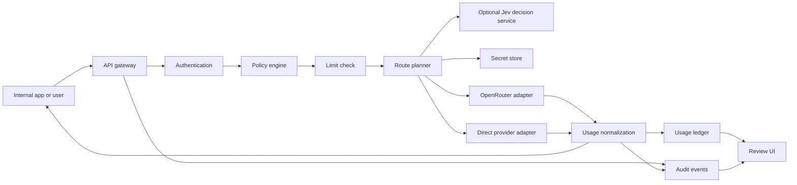

# Architecture Draft

Status: Internal authorization, portable deployment, dual upstream modes, initial selection controls, and same-kind fallback are decided; exact scoring and several release policies remain open. Updated 2026-09-27.

## Core decision

OpenGranter does **not** call AWS IAM to decide access. Its policy engine adopts default denial, explicit Deny precedence, and principal/action/resource concepts. It does not reproduce every AWS IAM policy type, STS, AssumeRole, SigV4, or cross-account semantics. A role is an assignable policy grouping, not a temporary role session in the first release.

## Request path



Authenticate and resolve the model alias to administrator-approved route candidates before authorization. Evaluate the applicable policy and limits for the requested model and the complete enforceable destination scope before contacting an upstream. A route that could select an unevaluated destination is rejected. Track upstream errors, timeouts, and client cancellation by request ID. If an upstream does not report token usage, store it as unknown rather than zero.

## Routing modes

| Mode | Selection owner | Credential and destination | Audit and accounting |
| --- | --- | --- | --- |
| Delegated | OpenRouter selects its eventual inference provider within an approved and enforceable route scope | OpenGranter uses a server-held OpenRouter key; the caller never receives it | Record OpenGranter's decision plus OpenRouter generation ID, actual model/provider when reported, and upstream cost |
| Managed | OpenGranter selects a registered direct provider and model | OpenGranter uses the selected provider's server-held key and registered host | Record the candidate set, selected route, attempted routes, provider response, and cost source |

A managed route may use TypeSafe Jev as a decision service. OpenGranter first applies IAM and all other eligibility checks, then sends only approved candidate descriptions to Jev. Jev returns a candidate ID; OpenGranter checks membership in the eligible set and calls the direct provider itself. Jev never supplies the upstream URL, provider credential, or route kind. Its API credential is a separate server-held secret. If Jev fails or gives an unusable recommendation, the confirmed fallback policy selects the first eligible candidate in administrator order and records the fallback reason. Sending prompt text to Jev requires an explicit administrator setting; the default request contains route metadata only. This disclosure default and the TypeSafe integration target remain pending product-owner confirmation. See [the routing contract](routing.md) and [ADR 0005](adr/0005-jev-as-managed-decision-service.md).

The TypeScript managed invocation coordinator connects IAM candidate filtering, a limit-check port, an audit-write port, and a direct-adapter invocation port. When a trusted route includes Jev settings, it also uses a Jev secret-reference port and the decision client; without those settings it selects the first eligible candidate in administrator order and records `source: "order"` before inference. The trusted caller must already authenticate the principal and provide a versioned route snapshot whose candidates have passed capability and health checks. The coordinator writes the start and decision audit events before the external decision and inference calls respectively. Its ports are tested with fakes; concrete HTTP authentication, durable stores, and usage reconciliation are still required for a runnable gateway.

The authenticated gateway requires a principal ID, credential ID, and policy IDs/versions before route lookup. These nonsecret references travel with the fixed request snapshot into invalid-request, route-failure, authorization, selection, decision, and attempt events. Authentication failures retain only the request ID because the caller's identity is untrusted. Missing attribution fails closed. Deployment wiring of durable audit storage, reader authorization, and retention remain separate work.

A PostgreSQL append adapter now projects the existing gateway, managed-route, and delegated-route audit events into allowlisted metadata fields before inserting them. It stores occurrence time, request ID, kind, authenticated attribution when present, and event-specific JSONB details. Anonymous authentication failures keep identity columns null. Unknown kinds, malformed details, and database errors produce fixed safe errors; required audit calls can therefore fail closed. The adapter does not serialize the original event object or retain prompts, responses, credentials, or upstream error bodies. Connection provisioning, read authorization, retention, tamper-resistant export, and retry/deduplication after ambiguous writes remain open.

A PostgreSQL audit reader selects one principal's events with a bound principal filter and descending event-ID keyset cursor. It validates every row and reuses the append projector to remove unexpected JSONB properties before returning a page. It rejects mixed-principal, anonymous, malformed, oversized, or out-of-order results as a whole. The authenticated `GET /v1/audit` boundary uses this injected reader after evaluating `audit:Read` on the target `principal:<id>`, including when the target defaults to the caller. It reprojects the returned page before responding and audits successful, denied, and unavailable reads. Anonymous/organization-wide search, retention, and export remain separate work.

A text-only, non-streaming `POST /v1/chat/completions` HTTP handler authenticates the presented proxy token through an injected identity port, validates the minimal request shape, resolves a trusted route, and dispatches a managed or delegated coordinator. The identity adapter verifies a credential through a port, loads a trusted principal/role/policy snapshot, and resolves every direct and inherited attachment before passing statements to the gateway. A PostgreSQL-backed credential store supplies an opaque-token verifier to that port. It stores only the SHA-256 digest of a versioned token containing independent random lookup and secret components. Every verification checks expiry and revocation, and issue and revoke writes append nonsecret lifecycle events atomically. The raw token is returned only on successful issuance. A trusted internal management coordinator evaluates `iam:Manage` on the target `principal:<id>` and writes a nonsecret decision audit before using the token primitive. For revocation it looks up the credential's immutable owner; a caller cannot nominate another target to widen authority. Successful mutation and lifecycle audit remain atomic in the token service. The coordinator takes an already authenticated actor with resolved policy statements, so SSO and an HTTP management endpoint remain separate work. Revoked or inactive identities and incomplete attachments fail closed; a missing or inconsistent snapshot returns a safe availability error. A Node HTTP server bridge exposes the handler on a socket; integration tests reach both route kinds with real HTTP requests and fake infrastructure ports. Direct OpenAI, Anthropic, and Gemini adapters translate the text subset against fixed official hosts through injected secret and HTTP ports. Provider-slug mapping reads now have a PostgreSQL adapter; secret and limit implementations remain deployment work; several snapshot, route, audit, and usage storage adapters are available but not yet wired into a deployment. This slice does not settle the release-level API field or streaming contract. See [ADR 0006](adr/0006-opaque-proxy-tokens.md).

A PostgreSQL catalog read adapter supplies the published-model and route-resolution ports. Each alias stores publication time, enabled state, and a reference to one active versioned route snapshot for that same alias. The reader returns only that active route, with ordered candidate IDs and secret references; it validates the entire bounded catalog snapshot before returning. Managed route snapshots may contain complete Jev settings or omit them entirely; missing Jev settings select the first IAM-eligible candidate in administrator order. The publication management API remains separate work. The storage choice of one active route for this reader does not settle how the product chooses among multiple routes in a future release.

The same authenticated HTTP boundary serves `GET /v1/models` from an injected administrator-published catalog. It returns an alias once if at least one managed or delegated candidate passes both model and final-provider IAM checks. Disabled, denied, malformed, or duplicate catalog entries never leak into a partial response; malformed or unavailable catalog snapshots fail closed with a safe service error. The response uses the alias's trusted publication timestamp and `owned_by: "opengranter"`. Listing does not call Jev, limits, secrets, or inference providers. A nonsecret listing audit event records the visible count before the response is returned.

A bounded OpenRouter adapter accepts one trusted model slug and an already-authorized set of OpenRouter provider slugs for the same text-only chat subset. It constructs `provider.only`, calls the fixed official endpoint with a server-held key, and normalizes the generation ID and known usage without exposing the key. The delegated coordinator filters model and final-provider IAM permissions, selects one upstream model, obtains exact verified slugs from an injected trusted mapping port, checks limits, writes attributed selection audit including the exact `provider.only` set, invokes the adapter, and writes the outcome before replying. Missing or ambiguous mappings fail closed. The concrete mapping verification workflow remains unresolved; an unverified broader slug would violate the IAM boundary and must not be supplied by a deployment.

After a Jev choice, the coordinator can try each remaining authorized managed candidate once when a direct adapter explicitly classifies a failure before any upstream response starts. It records every attempt before moving on, never crosses into a delegated route, and never re-queries Jev during that request. Current direct adapters treat an HTTP 429 or 5xx response as response-started and stop replay; a pre-response timeout may retry. An unclassified failure or any response-started failure ends the chain. Adapters must report possible billing for uncertain attempts; durable usage reconciliation remains separate work.

Both modes expose the same OpenAI-compatible API subset and use the same principal, proxy token, IAM evaluator, limits, and audit pipeline. An administrator may publish different model aliases for different modes or attach multiple approved routes to one alias. A route change is a configuration change with an audit event and version. Fallback stays within the selected route kind; it never silently switches between OpenRouter-delegated and direct managed paths. The [routing contract](routing.md) defines candidate filtering and selection controls; exact scoring and retry triggers remain open.

OpenRouter may use `models`, presets, automatic routing, and provider preferences to pick a model or provider. OpenGranter evaluates `llm:InvokeModel` on the alias and `llm:UseProvider` on each eligible final inference provider. It sends a server-generated `provider.only` allowlist to OpenRouter and rejects any routing field or configuration that could reach an unevaluated model/provider pair. OpenRouter model fallback is handled as separate bounded attempts, not as an unchecked forwarded array. A response's actual model and provider are recorded, but post-response inspection cannot substitute for pre-call authorization. [OpenRouter provider selection](https://openrouter.ai/docs/guides/routing/provider-selection), [OpenRouter fallback](https://openrouter.ai/docs/guides/routing/model-fallbacks).

## Data boundaries

| Component | Data owned | Boundary |
| --- | --- | --- |
| Identity store | Human users, service accounts, role assignments | Separate external IdP identity from internal principal ID |
| Policy store | Versioned policies, attachments, change history | Retain the policy version used for a decision |
| Model catalog and route store | Alias, approved route candidates, upstream model ID, subscription, active state, route version | Callers cannot specify an upstream URL or an unregistered route |
| Secret store | Raw OpenRouter and direct-provider credentials | Application database holds reference and version only |
| Usage ledger | Per-attempt tokens, status, estimated and upstream-reported cost, route and principal attribution | Keep immutable events separate from reporting aggregates; correlate attempts by request ID and reconcile OpenRouter generation IDs |
| Audit event store | Actor, action, target, outcome, request ID | Do not embed raw keys, prompts, or responses |
| Content-audit store | Optionally retained prompts and responses | Link by event ID; separate encryption, access, and retention |

The usage-record builder prepares one content-free record per upstream attempt. Both route coordinators hand it to an injected ledger port before retrying another candidate or returning a response. A stable request ID, route kind, and attempt ordinal identify the handoff. A PostgreSQL adapter stores an allowlisted JSONB record behind a unique attempt ID; exact retries are no-ops and conflicting retries never overwrite the original. Its parameterized migration and write path are verified against embedded PostgreSQL. A failed handoff stops fallback, emits a nonsecret failure audit event when possible, and returns a safe service error without replaying inference. Missing token counts and the actual OpenRouter provider remain unknown. When one OpenRouter call permits several candidates, its selected candidate also remains unknown. Estimated and upstream-billed costs retain separate provenance, but neither is calculated here. Connection provisioning, deployment migration orchestration, recovery after database outages, and reconciliation remain later work.

A TypeScript migration runner accepts the ordered SQL sources and a dedicated transaction-capable PostgreSQL connection. It tracks each applied version with a SHA-256 checksum, rejects changed or missing historical versions before later SQL, and commits each migration's SQL with its history row in one transaction. Tests apply all current migrations together against embedded PostgreSQL. The runner does not open production connections, coordinate multiple migrator processes, or provide down migrations; deployments must run one migrator per database until those operational controls are designed.

The authenticated `GET /v1/usage` extension reads one principal at a time. An omitted `principal_id` evaluates `usage:ReadSelf` on the caller's `principal:<id>` resource; an explicit `principal_id` evaluates `usage:ReadAll` on that target, even when the target is the caller. The PostgreSQL reader always binds the principal filter and uses occurrence time plus attempt ID for bounded keyset pagination. The HTTP boundary validates and projects stored rows, rejects mixed-principal or malformed results as a whole, and writes a nonsecret read audit event before returning. CSV export, aggregate views, and deployed connection provisioning remain later work.

## Policy contract

Example:

```json
{
  "version": "1",
  "statements": [
    {"effect": "Allow", "actions": ["llm:InvokeModel"], "resources": ["model:approved-*"]},
    {"effect": "Deny", "actions": ["llm:InvokeModel"], "resources": ["model:approved-expensive"]}
  ]
}
```

Evaluation: principal active state → credential scope → direct and role policies → explicit Deny → Allow → default Deny. Only `*` is a wildcard; regular expressions are not supported. Administrators pass through policy evaluation, with an explicit system policy granting bootstrap rights. Supported conditions, such as time or team, require a separate decision. The policy simulator must call the same evaluator as the gateway.

A PostgreSQL identity reader stores principals, roles, versioned policies, and their attachments in normalized tables. It loads one principal's direct policy IDs, assigned roles, and referenced policies in one SQL statement to retain a consistent database view. The reader validates the JSONB policy statements and returns only the fields expected by the existing attachment authenticator. Missing principals return no snapshot; malformed or incomplete references fail closed with a safe availability error. Management writes, SSO identity mapping, policy version history, and connection provisioning remain separate work.

## API and operations

Implementation language: TypeScript on Node.js 22. Code rules and quality gates are in [coding.md](coding.md). PostgreSQL is implemented for the usage-ledger write adapter; API framework, UI library, and persistence choices for the other stores remain open.

- External API: `GET /v1/models`, `POST /v1/chat/completions`, `GET /v1/usage`, and `GET /v1/audit` (the latter two are authenticated extensions).
- Management API: principals, roles, policies, providers/subscriptions, models, credentials, usage, and audit events.
- Upstream adapters: normalize requests, responses, errors, and token data. Build OpenRouter, OpenAI, Anthropic Messages, and Google Gemini adapters for the first release.
- Route planner: resolve aliases, filter to registered and allowed model/provider pairs, select healthy candidates using price by default or an administrator's order/latency/throughput preference, and document every attempted route. Fallback stays within one route kind. Exact scores and retry triggers remain open.
- Deployment: support AWS and on-premises installations through environment-specific implementations of storage and infrastructure interfaces.
- Observability: collect request IDs, latency, status, provider failure rates, and audit-write failures. Keep raw prompts out of operational logs and metrics; only store them in the protected content-audit store when enabled.

## Failure and security boundaries

Fail closed when authentication, policy, route bounds, secrets, or required audit writes fail. If usage recording fails after a completed upstream call, recover the ledger through a retry queue and alert. Enforce request-size and time limits. Restrict upstream destinations to administrator-registered hosts and test defenses against redirects, private IPs, and DNS changes. Streaming requires defined handling for token accounting and interrupted connections before release. A direct OpenRouter key outside OpenGranter can bypass its policies; an organization that requires enforcement must govern direct key access separately.

## Decisions still needed

1. Supported OpenRouter request options and first API capability set across all four adapters.
2. Company SSO protocol, proxy-token maximum lifetime, and trusted management API for service-account credentials.
3. Operational configuration, secret delivery, migration coordination, and process startup for the PostgreSQL driver and secret stores in AWS and on-premises deployments.
4. Whether monthly limits warn or block, and how concurrent calls reserve capacity.
5. Content-audit default, configuration scope, retention, reader permissions, and tamper-resistant export.
6. Whether streaming is part of the initial release.
7. Exact managed-route score, metric freshness, and retry triggers.
8. OpenRouter provider-ID mapping and verification of provider restrictions for delegated routes.

## References

- [AWS IAM policy evaluation](https://docs.aws.amazon.com/IAM/latest/UserGuide/reference_policies_evaluation-logic_policy-eval-denyallow.html)
- [OpenRouter API format](https://openrouter.ai/docs/quickstart)
- [AWS Secrets Manager](https://docs.aws.amazon.com/secretsmanager/latest/userguide/intro.html)

## PostgreSQL gateway composition

`createPostgresChatHandler` connects the existing credential verifier, IAM snapshot reader, model catalog, audit append/history, and usage append/history to the HTTP handler through one injected query client. The caller supplies request IDs, clock, limits, secrets, and registered provider ports. It neither opens connections nor runs migrations, issues tokens, or creates management endpoints. Embedded PostgreSQL integration tests apply all migrations and exercise issued tokens through HTTP authorization, inference, and persisted history. Connection provisioning and process startup remain deployment work.

`createNodeRequestServer` adapts an already-composed Fetch-style handler to a Node socket server. The original gateway-port factory and `createNodePostgresChatServer` share that bridge. The PostgreSQL server factory returns an unbound server; callers own listen/close, database connections, and process lifecycle. Socket integration tests reach the PostgreSQL stores and a registered direct adapter through real HTTP, with a fake provider transport.

## PostgreSQL driver ownership

`createPostgresConnection` creates a node-postgres pool from trusted deployment configuration. Its query port supports existing stores and HTTP composition; its transaction port supports migrations. `adaptPostgresPool` owns an injected pool with the same lifecycle. Transactions acquire one dedicated client, invalidate the callback handle before commit/release, roll back callback failures, reject success after even a caught query failure, and discard connections after uncertain commits or failed rollback. Checked-out client error events prevent commit and discard the connection. Driver errors become fixed `PostgresUnavailable` errors without SQL, parameters, connection credentials, or nested driver causes. Application callback errors survive successful rollback. No transaction or inference is automatically replayed.

An optional idle-error notification receives only that safe error; notification failures cannot crash the pool listener. `close()` is idempotent, rejects new work, and drains existing pool clients. Callers own HTTP shutdown order, configuration/TLS, secret delivery, pool limits, migrations, and concurrent migrator coordination. The factory does not load environment variables or start a process. CI uses a disposable PostgreSQL service to verify the full migration set, parameter binding, rollback, and closure. Local integration runs require `OPENGRANTER_TEST_DATABASE_URL` pointing to a disposable database; never point this test at production.


## Persisted direct provider registrations

Migration `007` adds `direct_provider_registrations` for administrator-managed OpenAI, Anthropic, and Google configuration: provider ID, kind, secret reference, enabled state, and optional output-token limit. Anthropic requires an explicit positive limit; any configured limit must fit a JavaScript safe integer. This table holds references, not provider keys or arbitrary upstream URLs.

`createPostgresDirectProviderRegistrationReader` queries enabled rows in provider-ID order and validates the complete snapshot with the same validator used by the direct invoker. It returns only allowlisted fields, makes defensive copies, and exposes a fixed safe availability error for SQL failures or malformed/duplicate rows. Disabled or unregistered providers cannot trigger secret lookup or transport through an invoker built from this snapshot. All hosts remain fixed by provider kind and IAM still governs model/provider eligibility.

Deployment code explicitly loads registrations and constructs the direct invoker. It must reload and rebuild that invoker after configuration changes; the snapshot does not provide immediate live disablement or rotation. Publication writes, configuration-change audit, IAM-protected management, and reload orchestration remain separate work. No new HTTP endpoint is added.

## Usage history filters

`GET /v1/usage` accepts optional `model`, `from_ms`, and `to_ms` in addition to principal selection, limit, and cursor. `model` is an exact requested alias, not an upstream model ID; aliases must be nonblank, at most 256 characters, without control characters. Times are canonical nonnegative safe-integer decimal milliseconds since the Unix epoch. The start is inclusive and the end is exclusive; a supplied start must precede a supplied end. Unknown or repeated parameters remain invalid.

The existing self/specified-principal IAM requirements apply to all filtered reads. PostgreSQL binds filter values alongside the principal predicate and descending keyset cursor, then validates all returned records against those filters. The HTTP boundary repeats this check for any injected ledger. Invalid queries return 400; out-of-filter pages fail with safe 503 and the required unavailable-read audit. No partial response is returned. Clients repeat the filters on subsequent pages; a cursor only sets a position and does not grant a different principal scope. The existing principal/time index supports narrowing; modelAlias uses JSONB extraction and has no dedicated index yet. CSV export and aggregation remain separate work.

## Gateway composition with persisted direct registrations

`createPostgresDirectChatHandler` loads one validated registration snapshot and supplies a direct invoker to the existing PostgreSQL HTTP handler. `createNodePostgresDirectChatServer` exposes that handler as an unbound Node server after the load succeeds. Both accept the caller's secret resolver, limits, clock, request IDs, and optional delegated/Jev ports. Direct transport and timeout options are forwarded to the existing adapter. Construction reads configuration only: no provider secret lookup, inference, migration, listening, or database shutdown occurs.

Unavailable or malformed registration storage rejects construction with its fixed safe error; no server is returned. Empty registrations are valid for deployments that have only delegated routes or no published managed models. Registered direct calls still pass through token authentication, full IAM destination evaluation, limits, audit, and usage accounting. The configuration is a startup snapshot, so deployments rebuild the handler/server after changing registrations. Callers continue owning database and HTTP resource lifecycle. Existing custom-invoker factories retain their signatures.

## Audit occurrence-time filters

`GET /v1/audit` accepts optional inclusive `from_ms` and exclusive `to_ms` occurrence-time bounds in epoch milliseconds. Values must be canonical nonnegative safe-integer decimals; when both are present, start must precede end. Duplicate and unknown query fields remain invalid. The target principal's `audit:Read` requirement applies to every range, including self reads.

The PostgreSQL reader binds the time predicates alongside the principal and event-ID cursor, and validates every row, including its lookahead record. The HTTP projection independently checks occurrence times for injected readers. Out-of-range data rejects the whole page with safe availability errors and required read auditing. Pagination remains descending by event ID, even when recorded occurrence times are not monotonic. Clients repeat the range with the next cursor; the cursor is only a position and never expands principal scope. No dedicated time index or schema change is introduced; benchmark ranges before changing indexes. Retention, organization-wide search, and content auditing remain separate work.

## Usage CSV page export

`GET /v1/usage?format=csv` exports the same authorized, validated usage page as JSON. `format=json` is explicit JSON; JSON remains the default. Unknown or repeated formats return 400. Existing principal selection, model/time filters, limit (at most 100), and cursor continue applying before serialization. No new permission or unbounded scan is introduced.

The response has `text/csv; charset=utf-8`, a fixed attachment filename, `Cache-Control: no-store`, `X-Request-Id`, and `X-Has-More`. `X-Next-Cursor` appears only when additional records exist. Clients repeat filters with that cursor. A file is one page, not a claim that the entire history was exported. Empty pages still contain the header row. Failures remain safe JSON errors, and required attributed usage-read auditing must succeed before any CSV is returned.

Columns are request/attempt/principal/credential identifiers, policy versions, requested alias, route kind, upstream model, candidate/provider attribution, occurrence time, latency, outcome, possibly-billed/duplicate flags, usage availability and counts, estimated decimal amount/currency/price version, and billed decimal amount/currency/source. Unknown values are empty cells; decimal amounts remain strings. The serializer reprojects only the metadata contract, excluding prompts, responses, raw tokens, keys, and extra fields.

Every cell is quoted, embedded quotes are doubled, and rows use CRLF. Formula-looking text (including whitespace, control-prefix, and full-width variants) receives a leading apostrophe for initial spreadsheet import. This intentionally changes CSV cell text; use JSON for exact machine-readable values. Spreadsheet save/reopen behavior varies, so this is not a universal formula-safety guarantee. See [OWASP guidance](https://owasp.org/www-community/attacks/CSV_Injection). Complete-history export jobs, audit CSV, and aggregates remain separate work.


## Audit CSV page export

`GET /v1/audit?format=csv` exports the same fully projected page as JSON; omitted format and explicit `format=json` retain JSON. Invalid/repeated formats return 400 before storage. The target-principal `audit:Read` check, occurrence-time bounds, event-ID cursor, maximum 100 events, and required read audit apply to both formats. Out-of-range, mixed-principal, anonymous, malformed, or unordered pages fail as safe JSON errors before any CSV response.

The response uses `text/csv; charset=utf-8`, the fixed `opengranter-audit.csv` filename, no-store caching, request ID, `X-Has-More`, and optional `X-Next-Cursor`. Clients repeat the principal/time filters with that event-ID cursor. Empty exports contain headers only; each file is one bounded page.

Columns contain event ID, occurrence time, kind, request/principal/credential IDs, policy versions, and sanitized details. Policy versions and details are quoted JSON cells, not arbitrary event bodies. The serializer reuses page projection with explicit target/query context before encoding. Usage and audit share CSV quoting, CRLF, and the documented apostrophe transformation for formula-looking text; usage's output contract stays unchanged. No content, provider keys, raw proxy tokens, or unexpected fields are exported. JSON is the exact machine-readable form. This download is not a tamper-resistant archive; full-history jobs, external retention, and verification remain separate work.

## Persisted token-management decisions

Migration `008` adds `token_management_decisions`. `createPostgresTokenManagementAuditStore` validates and projects only operation, outcome, actor, target owner, request, optional credential, policy IDs/versions, and occurrence time into parameterized SQL. It never serializes the input object or policy statements wholesale. Unknown-owner and inactive-actor revocation denials may have a null target. Revocation decisions have a credential ID; issuance decisions do not yet have one. There is no credential foreign key because nonexistent-credential denials must remain recordable.

`createPostgresTokenManagementCoordinator({ client, now })` connects that required append port to the existing IAM coordinator and PostgreSQL credential service. Trusted callers authenticate actors and resolve their policies before invoking it. Required decision-write failure stops mutation. Credential mutation and lifecycle-event writes remain atomic; decision and mutation are separate writes. A grant can survive a failed mutation and means authorization only. Request and actor IDs correlate decisions with completed lifecycle events; request IDs are correlation values, not deduplication keys. Decisions are outside the gateway audit-history reader. Public management endpoints, history access policy, retention, reconciliation, and tamper resistance remain open.

## Migration-gated server construction

`createMigratedNodePostgresDirectChatServer` accepts the persisted-direct server ports, a query/transaction client, and the complete trusted SQL migration source set. It awaits the existing migration runner before reading registrations or composing the server. Unchanged historical checksums are verified on every construction; migration validation, checksum mismatch, and SQL failures prevent server construction. Fixed safe migration and registration-store errors remain observable without SQL, secrets, or driver causes. Startup does not resolve secrets or contact providers.

The returned Node server is unbound. Callers own listen/close, database shutdown, migration source provisioning/completeness, and exclusive migration coordination. Use repository migration files in version order; never obtain SQL sources from an HTTP caller. Sequential reconstruction skips unchanged migrations and reloads registration snapshots. Each migration commits independently; a later migration or registration-read failure leaves earlier commits intact. Existing lower-level factories remain available when deployment has a separate migration phase. This function does not start a process, provision secrets/limits, automatically roll back schema, or coordinate concurrent migrators.

## Bundled migration source provisioning

`loadPostgresMigrationSources(directory?)` loads the explicit manifest in `src/storage/postgres-migration-sources.ts`. The default directory is resolved relative to the module, not the process working directory. A trusted deployment may supply a local directory URL containing the same complete set. Every SQL entry must be a regular file with a listed name: missing trailing files, unregistered/duplicate-version names, and SQL symlink/directory entries fail before database access. Non-SQL notes are ignored. SQL is read as UTF-8 without rewriting whitespace, comments, or line endings, preserving its checksum text; whitespace-only SQL is rejected. Filesystem and validation failures expose only `MigrationSourceUnavailable`, without paths, SQL, or nested causes.

`createBundledNodePostgresDirectChatServer` accepts migration-capable server ports without a source array and an optional trusted `migrationDirectory`. It fully loads sources before invoking the migration-gated factory. A loading failure performs no database, clock, secret, or provider activity. The returned server remains unbound and retains existing HTTP authentication and IAM behavior.

Ship `migrations/` alongside the source modules and update the explicit manifest whenever adding a migration; the bundled-loader regression checks all shipped SQL files. The manifest detects completeness, not file authenticity. Deployment must protect its bundle from modification and serialize migrators. Filesystem race protection, artifact signing, automatic process startup, and resource shutdown remain outside this adapter. Lower-level source-array factories remain available.

## Owned gateway runtime lifecycle

`startPostgresGateway` accepts existing direct-server infrastructure ports without a client, plus a trusted `openConnection`, explicit bind `host`/`port`, and optional trusted `migrationDirectory`. Blank/whitespace/NUL-containing hosts and invalid port ranges reject before acquiring resources. Port zero requests an ephemeral listener. Complete source loading precedes connection opening; migrations and configuration loading precede listening. The connection becomes runtime-owned once the opening port returns it. Deployment can supply `openConnection: () => createPostgresConnection(config)` using its protected configuration.

The result contains the actual bound address and `close()`, without exposing the underlying server or connection. Close stops accepting HTTP, waits for active requests and their storage/audit writes, then attempts database closure. Concurrent/repeated closes share the same promise, including failure; no automatic cleanup retry occurs. Database closure is attempted even if server closure reports an error. Startup failure attempts to close every acquired resource and returns only `GatewayStartupUnavailable`; invalid bind configuration uses `InvalidGatewayRuntimeInput`, and failed shutdown uses `GatewayShutdownUnavailable`. These fixed errors contain no deployment values, SQL, filesystem paths, or nested causes. Cleanup failure cannot certify that external resources were released.

This library starts plain Node HTTP, matching the existing bridge. Production TLS/reverse-proxy configuration remains required deployment work. Operators supply secret/limit/upstream ports and serialize migration runs. CLI/environment parsing, process signal handling, readiness probes, and bounded/forced shutdown policy remain open. A close may wait for a stalled active request; no arbitrary timeout or forced cancellation is introduced. Already committed migrations survive later startup failures. Lower-level factories preserve caller-owned lifecycle behavior.

## Audit model-alias filtering

`GET /v1/audit?model=<alias>` adds exact, case-sensitive filtering to JSON and CSV pages. The value is nonblank, at most 256 characters, and contains no control characters; it is not trimmed or interpreted as a wildcard. Unknown aliases return an empty authorized page. The filter matches only the known event projection's `details.modelAlias`. Events without a single model alias (including model lists and audit reads) are excluded when filtering; unfiltered behavior is unchanged.

The PostgreSQL reader binds model equality alongside principal, event-ID cursor, and occurrence-time bounds. All rows, including lookahead, must match after known-field projection. An arbitrary stored field on an event whose contract has no alias cannot establish a match; it makes a filtered page unavailable. The HTTP boundary independently enforces this rule for injected readers, and CSV uses the same projection. Clients repeat model, principal, and time filters with each continuation cursor.

Target-principal `audit:Read` and required attributed read audit remain mandatory. No model-invocation permission is added: an auditor may inspect a model they cannot invoke. Out-of-filter pages fail as safe JSON errors before success audit or CSV response. No schema/index change or content/token-management history is introduced; benchmark filtered queries before choosing indexes.

## Complete usage pagination validation

Usage history uses strict descending occurrence-time and UTF-8 attempt-ID order. PostgreSQL applies `COLLATE "C"` to both tuple comparison and attempt-ID sorting; application validation compares UTF-8 buffers, so locale/UTF-16 differences cannot change tie ordering. See [ADR 0007](adr/0007-usage-pagination-order.md).

Internal cursor objects must contain a nonnegative safe-integer timestamp and a nonblank attempt ID of at most 512 characters before SQL runs. SQL validates every normalized row, including lookahead, against the cursor and previous key; duplicate attempt IDs are invalid even if timestamps differ. The HTTP boundary independently checks injected pages before continuation, success audit, or JSON/CSV output. A repeated cursor attempt, equal/newer position, duplicate, or ascending sequence fails the entire page as a safe availability error. Principal/model/time scope and metadata projection remain enforced separately.

Cursor encoding stays unchanged, but clients restart pagination when deploying or reverting this tie-ordering contract. No schema/index change is introduced. Under a non-C default database locale, the existing index may require an additional sort; benchmark before adding a matching index. No ledger mutation, new permission, inference replay, or usage aggregation is introduced.

## Current actor policies for token management

`createPostgresTokenManagementService({ client, now })` provides an internal trusted facade over the persisted token-management coordinator. It accepts `authenticatedActorId` from prior authentication, loads the existing single-statement PostgreSQL principal/role/policy snapshot on each operation, resolves all direct and inherited attachments, and explicitly projects only validated operation fields into the coordinator. Extra caller actor, policy, or owner fields are ignored. No public authentication or HTTP management route is added.

Missing/inactive actors enter the existing required denied-decision path with their trusted authenticated ID, inactive state, and empty evaluated policy versions. Active actors with no attachments default deny. Malformed, incomplete, or unavailable snapshots return only `TokenManagementUnavailable` and cannot authorize mutation; without a reliable snapshot, no policy decision is recorded. Required decision-store failure still prevents mutation. Revocation continues deriving its immutable target from stored credentials.

This adds no schema or cross-operation cache. Each actor snapshot is consistent at the read; concurrent changes after that read are not revalidated or locked across subsequent decision and mutation writes. Allowed decisions remain authorization evidence, while atomic credential lifecycle events record completion. The lower-level resolved-actor coordinator remains available to trusted callers responsible for providing fresh snapshots. See the [internal contract](../contracts/token-management.md).

## Persisted verified OpenRouter provider mappings

Migration `009` adds `openrouter_provider_mappings` keyed by inference-provider ID and upstream model ID. Rows carry provider slug, enabled state, and explicit verified state. A partial unique index prevents two enabled, verified IAM provider IDs from claiming the same model/slug; disabled or unverified staging rows cannot resolve. No provider credentials, arbitrary destinations, or caller overrides are stored here.

`createPostgresOpenRouterProviderMappingResolver(client)` implements the existing delegated mapping port through a parameterized exact-pair query. It validates inputs before SQL and validates every returned row's scope, activation/verification flags, and bounded OpenRouter slug syntax. Missing eligible rows yield no mapping; malformed/duplicate/out-of-scope rows and driver failures return fixed errors without causes. Only the slug leaves the reader.

Deployment code supplies this resolver explicitly after migrations. The existing coordinator filters IAM candidates before lookup and forwards only authorized slugs; a missing mapping stops before limits or inference. Verification is administrator attestation, not an automatic network check. Configuration writes and their required audits, verification procedures, and automatic composition remain separate work. Each lookup reads current state, but multiple candidate lookups do not share a transaction snapshot and changes after a read are not revalidated before inference. See the [mapping contract](../contracts/openrouter-provider-mappings.md).

## Persisted dual-route gateway composition

`createPostgresDualRouteChatHandler` reuses the persisted direct handler, supplies the per-call PostgreSQL verified provider mapping resolver, and constructs an OpenRouter invoker with each trusted delegated route's secret reference. Both adapter families share the injected secret resolver and optional transport/timeout configuration; omitted settings preserve their existing defaults. Generated mapping and invocation ports overwrite any extra runtime fields. Optional Jev configuration remains on the existing managed path.

`createNodePostgresDualRouteChatServer` wraps this handler with the existing request bridge and returns an unbound server. Construction loads enabled direct registrations but retrieves no secrets or upstream data; an empty registration set supports delegated-only installations. The caller applies migrations and owns listening and DB shutdown. Existing direct/custom factories remain available.

Both route kinds keep current token/attachment authentication, model/final-provider IAM, limits, sanitized audit, and per-attempt usage. Delegated mapping/configuration failures return existing safe errors before inference; upstream failures never switch to direct routes. Direct registrations remain a construction snapshot, while mappings read per lookup; concurrent changes after those reads are not revalidated. CLI/environment wiring, SSO, management endpoints, live reload, and secret/limit implementations remain separate work. See the [composition contract](../contracts/persisted-dual-gateway.md).

## Persisted policy simulation

`createPostgresPolicySimulator(client)` composes the existing single-statement identity reader and pure attachment evaluator for trusted internal diagnostics. It validates bounded principal/action/resource strings before SQL, loads a current complete snapshot per call, and explicitly passes only that snapshot plus the requested action/resource to evaluation. Caller policy/state fields cannot affect results. Missing principals return no result; valid inactive principals deny with empty evaluated policy versions. Malformed/incomplete/unavailable snapshots produce fixed simulator errors without driver causes or partial grants.

Results contain only effect, existing reason, and evaluated policy IDs/versions. No statements, secrets, content, credential writes, inference, audit append, or usage append are involved. This is IAM simulation only: it does not authenticate credentials, check catalog/provider readiness or limits, or guarantee a successful invocation. The caller restricts access to this internal read capability. Public simulator authentication, reader scope, read audit, and hypothetical policy editing remain open.

One snapshot is consistent at its read; later concurrent changes are not revalidated. Using the same evaluator aligns simulation and gateway IAM for the same persisted state. Tests compare current model/provider simulation to live PostgreSQL HTTP gateway Allow/Deny behavior. See the [simulator contract](../contracts/persisted-policy-simulator.md).

## Owned dual-route runtime

`startPostgresDualRouteGateway` owns connection opening, complete bundled schema verification/application, persisted dual server construction, listening, and shutdown. A private lifecycle helper is shared with `startPostgresGateway`; the public wrappers select fixed server compositions rather than exposing a caller-supplied server builder. Schema application now occurs in the shared lifecycle before either composition, preserving the prior direct startup order.

Both wrappers validate bind input before source/DB work, load SQL before opening a connection, and listen only after migrations and registrations succeed. They return a copied address and one shared shutdown promise. Shutdown drains active HTTP work before DB close; startup failures attempt cleanup and expose fixed errors. Cleanup is not automatically retried and carries no raw infrastructure cause.

The dual wrapper supplies generated direct/OpenRouter invokers and the persisted verified mapping reader, with unchanged token/IAM/limit/audit/usage paths. Shared lifecycle tests run against both wrappers; a fresh-schema socket test calls both route kinds and inspects stored history. No new schema, CLI/environment parser, process signal handling, TLS, shutdown deadline, or live reload is supplied. Operators still serialize migration startup and provide secret/limit implementations. See the [runtime contract](../contracts/dual-gateway-runtime.md).

## Evaluated route candidate snapshots

`authorizeCandidates` copies only candidate ID, route kind, upstream model ID, and provider ID before evaluating provider permission. Eligible objects, the ordered array, and the result are frozen; unrelated runtime fields are stripped. Source configuration remains caller-owned and mutable, but later updates cannot change the already evaluated destination or audit attribution.

Managed selectors/limits/fallback and delegated mapping callbacks therefore retain the evaluated candidate snapshot across async work. New source values affect a new authorization call only. This changes neither policy matching nor route order/kind isolation and does not add live reload, cross-operation DB locking, or policy snapshot revalidation. Consumers already receive readonly TypeScript values; attempted snapshot mutation now follows standard frozen-object behavior, with existing callback-exception handling unchanged. See the [snapshot contract](../contracts/route-candidate-snapshots.md).

## Strict chat input decoding

The chat boundary incrementally decodes UTF-8 with fatal errors and flushes at end of input to detect incomplete sequences. Invalid encoding follows the existing metadata denial audit and invalid-request response before route, limit, secret, usage, or inference work. Cancel unread input on decoding failure and always release the reader lock. Valid split Unicode and literal replacement characters are preserved; the byte-size cap remains unchanged. See [contract](../contracts/chat-utf8.md).

## Direct usage projection

Direct adapters normalize each recognized token counter independently. Valid supplied integers survive partial reporting; invalid values become null and absent fields remain absent. Derive a missing total only from two valid components and a safe sum. The existing gateway ledger then retains reported/partial/missing/invalid availability without raw upstream error values. See [contract](../contracts/direct-usage-availability.md).

## Shared completion token projection

Direct and OpenRouter adapters share the pure known-counter projector. Provider-specific field mapping precedes projection; gateway accounting classifies the projected counters with its existing availability labels. Missing and invalid supplied totals remain distinct, and no unsafe sum or raw invalid field enters normalized responses. Delegated provider bounds and failure metadata remain unchanged. See [contract](../contracts/delegated-usage-availability.md).

## Direct timeout boundary

The direct invoker captures and validates the attempt timeout before asynchronous credential resolution. It uses the captured value for the upstream signal even if source configuration changes during lookup. Invalid durations fail through existing other-category metadata before secret or network access; delegated and direct bounds agree. See [contract](../contracts/direct-timeout-validation.md).

## Delegated timeout capture

The delegated invoker reads the optional timeout once, validates its resolved duration before credential lookup, and uses that local value for the upstream signal. Source configuration updates during lookup affect later attempts only. See [contract](../contracts/openrouter-timeout-snapshot.md).

## Usage container boundary

A shared pure boundary validates the upstream usage container before provider-specific known-counter projection. Absent/null means missing; a non-null primitive or array becomes a sanitized null-counter marker for the existing invalid ledger state. Empty/unrecognized-only objects remain missing. Response and accounting retain no raw malformed value. See [contract](../contracts/provider-usage-containers.md).

## Chat media type boundary

The JSON reader compares the normalized type segment exactly with application/json rather than matching a prefix. The existing authenticated invalid-request and audit-unavailable paths apply before body processing or downstream calls; UTF-8 and size bounds remain unchanged. See [contract](../contracts/chat-media-type.md).
