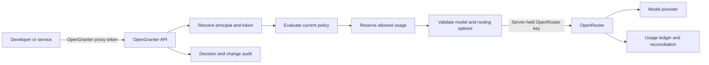

# OpenRouter Control Layer: Architecture Review

Status: Research on the delegated OpenRouter route. The product direction now includes a managed direct-provider route; see [architecture](../architecture.md). Reviewed 2026-09-27.

## Customer and value hypothesis

The initial customer is a company already using OpenRouter across multiple developers and internal services. Its platform or security team needs a company-controlled point of enforcement and an audit record that maps each call to its own principal, policy version, and approval context. The developer experience should require only a base URL and API token change for the supported API subset.

OpenRouter already has workspaces, member and key guardrails, budgets, model/provider restrictions, BYOK, SSO/SCIM, and usage logs. These are substantial capabilities. The candidate value is therefore **specific internal policy semantics and company-owned audit evidence**, not generic API key issuance or model allowlists. The gap must be validated with prospective users before broad implementation. [Workspaces](https://openrouter.ai/docs/guides/features/workspaces/overview), [Guardrails](https://openrouter.ai/docs/guides/features/guardrails/overview), [Enterprise](https://openrouter.ai/enterprise/).

## Candidate request path

Proposed public path: `POST /v1/chat/completions` and `GET /v1/models`. An OpenAI SDK would point `baseURL` to OpenGranter and use an OpenGranter proxy token as `apiKey`; OpenGranter would call OpenRouter's compatible endpoint with a server-held OpenRouter key. This compatibility claim applies only to fields and endpoints that contract tests cover. [OpenRouter quickstart](https://openrouter.ai/docs/quickstart).

OpenRouter remains the model router, catalog source, and upstream biller. OpenGranter owns principal identity, token lifecycle, policy evaluation, local limits, and company-side audit. It should record both its request ID and any upstream generation/request ID so the usage ledger can be reconciled against OpenRouter generation metadata. Estimated cost and reported upstream cost are different fields. [Generation metadata](https://openrouter.ai/docs/api/api-reference/generations/get-generation).

## Boundaries that need explicit design

1. **Bypass:** A user with an independently usable OpenRouter key can avoid OpenGranter. A real enforcement claim requires control over direct key issuance and usage through the OpenRouter organization, network, or procurement process. This is an organizational prerequisite, not a proxy feature.
2. **Routing escape paths:** OpenRouter accepts fallback models and other routing options. OpenGranter must inspect every model that may be selected, or reject options it cannot prove safe. Never authorize only the primary `model` while forwarding an unchecked `models` array, preset, or automatic route. [Model fallback](https://openrouter.ai/docs/guides/routing/model-fallbacks), [Chat API](https://openrouter.ai/docs/api/api-reference/chat/send-chat-completion-request).
3. **Credential boundary:** The caller receives an OpenGranter proxy token, never the OpenRouter key or a provider BYOK key. The first candidate is a workspace-scoped OpenRouter key held in the secret store. Whether to use one or several upstream keys is unresolved. OpenRouter BYOK would remain an OpenRouter-side configuration, not a key returned to callers.
4. **Identity attribution:** If many callers share an upstream key, OpenRouter's own key-level attribution is coarser than OpenGranter's. Record a local principal and token ID for every call, and verify whether an upstream end-user identifier can safely help reconciliation without exposing employee data.
5. **Audit and availability:** Write a durable decision event before sending an allowed call upstream; fail closed if that required write fails. Preserve policy version, action, resource, reason code, actor, token ID, and request ID. Handle partial streaming, cancellations, upstream timeouts, and delayed usage reconciliation without claiming a failed client response was free.
6. **Content retention:** Optional prompt/response auditing must have explicit scope, reader permissions, encryption, and retention. A local proxy does not keep inference data inside the company when requests still travel through OpenRouter and its selected providers.
7. **Latency and streaming:** A second network hop and audit writes add latency. Measure time to first token and tail latency on real streaming workloads. Avoid buffering an entire response merely to audit it.

## Narrow first slice to validate

- One organization and one OpenRouter workspace with a server-held upstream key.
- Human and service principals, separately issued OpenGranter proxy tokens, immediate revocation, and current-policy evaluation on each request.
- A fixed allowlisted set of OpenRouter model slugs; reject unsupported routing overrides until every possible route can be authorized.
- OpenAI-compatible chat completions and model listing, with contract tests for common SDK calls, non-streaming, and streaming if selected for the first release.
- Local decision and administrative-change audit, per-principal usage, and reconciliation with OpenRouter generation records. Optional content capture remains a separately configured feature.

## Validation gates before committing to the positioning

1. Ask several OpenRouter-using teams for one concrete policy or audit requirement they cannot satisfy with current workspaces, guardrails, management API, and logs. Record the exact current workaround and buyer.
2. Test whether changing only base URL and token works for their actual SDK payloads and streams; enumerate unsupported options rather than promising full OpenRouter compatibility.
3. Demonstrate a policy change or token revocation taking effect on the next request, with an audit trail that explains the decision.
4. Reconcile a sample of local usage records to OpenRouter records, including a cancelled stream and an upstream failure.
5. Confirm that direct OpenRouter keys cannot bypass the intended organizational control.

## Decisions still open

- OpenRouter and managed selection among direct OpenAI, Anthropic, and Google Gemini routes are in the first-release target; see the [routing contract](../routing.md).
- Are upstream OpenRouter keys shared per workspace, assigned per service, or mapped per principal?
- Who may issue proxy tokens, how many may a principal hold, and do they always reflect current policy?
- Which OpenRouter-specific request options and streaming modes must work in the first release?
- What exact audit evidence is the buyer missing from OpenRouter today?
